# Analysis and Tracing of the ObserverStealer

## Foreword
Since May this year, we have found a Trojan named ObserverStealer being sold on multiple hacker forums. This Trojan has powerful malicious functions. It can steal users' browser data, upload files from specified directories, obtain screenshots, and even download and run other malicious payloads.

During our monitoring process, we also observed the occurrence of such events.

Therefore, today we will start from this angle, collect IOCs through various channels, and use FOFA and any.run tools to conduct in-depth asset wiretapping analysis of this goal.

## IOC Collection
 
**Sample Analysis**

Recent monitoring has found that many teams profiting from selling personal user browser save information suddenly appeared on Telegram. Including user's personal account password, personal computer information, etc. And there are a large number of Chinese IP accounts in the samples.

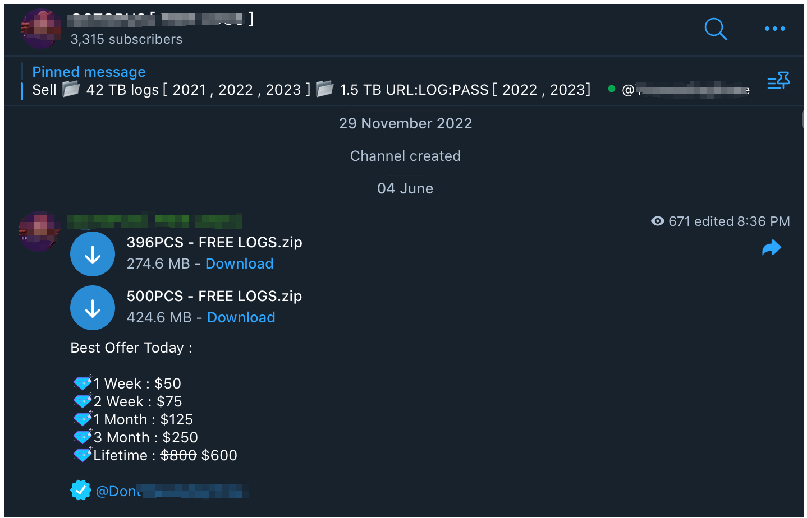

From the sample data they gave, it was found that this is a team called stealc steader, and it can be seen that after parsing the sample data, the account and password saved in the browser by the user will appear directly.

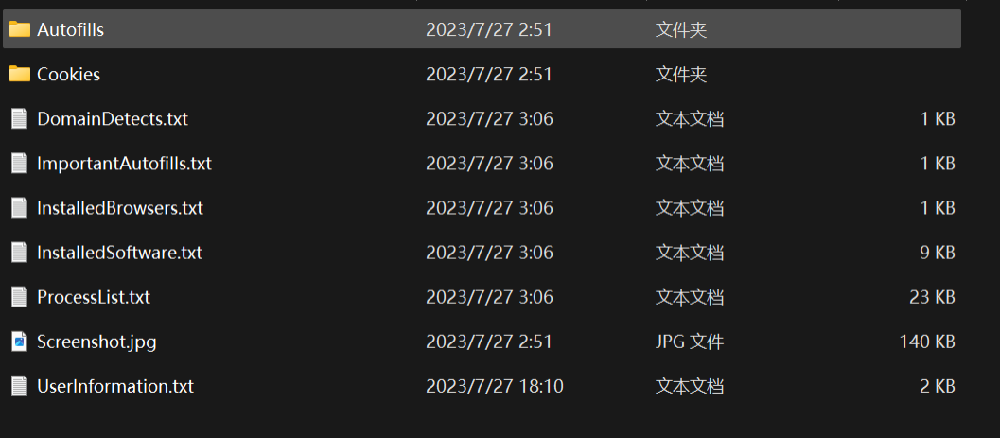

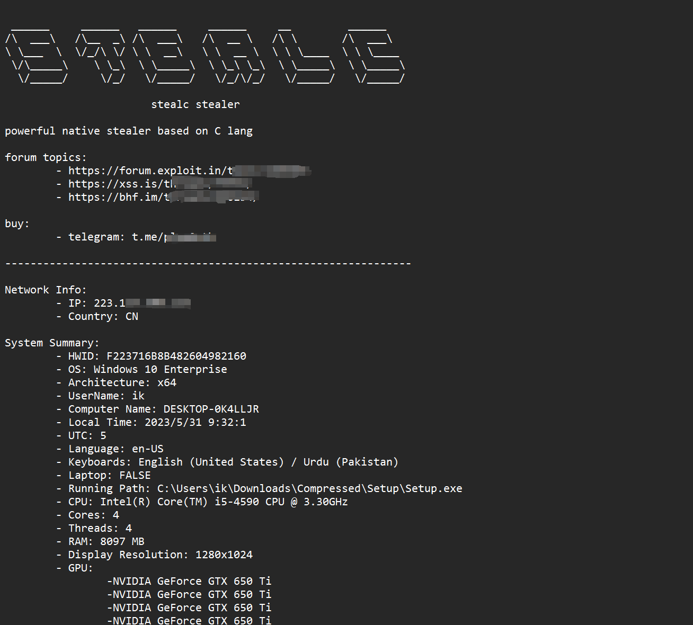

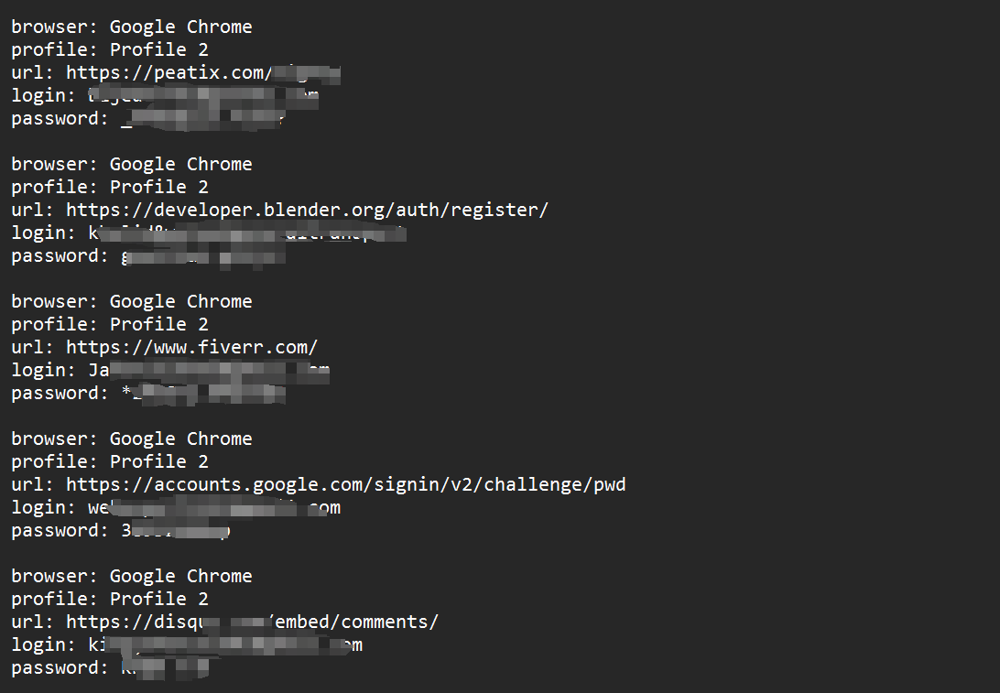

Even according to the sample, you can see the screenshots of the controlled person.

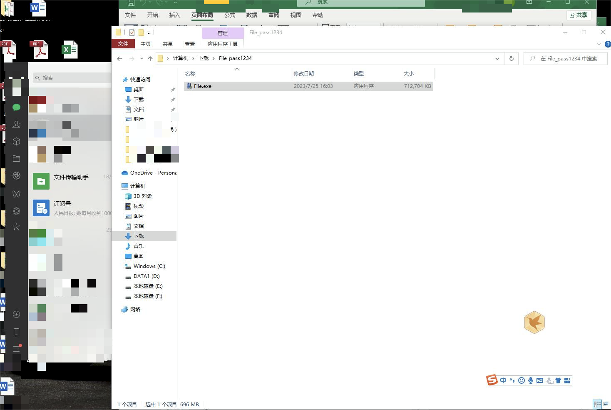


We continued to search through these clues and found this TG account. It is inferred from this account that this organization comes from the Russian-speaking region, and they have long been advertising and selling data on xss.is and exploit.in.

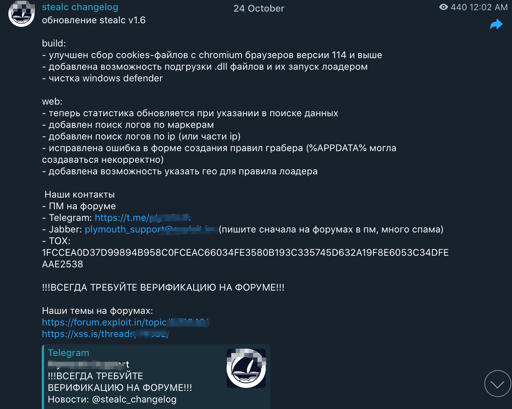

**Internet Retrieval**

  
We conducted a search based on the information obtained above and found that the Group-IB security team exposed a similar information in May, calling it Observer Stealer. 

Group-IB revealed that someone was selling user browser saved account password information, personal computer information on the xss.is website at a price of 150 USD/month. The same as what we found!

From the tweet information of Group-IB, it can be found that this platform can directly generate exe executable files and collect information on the relevant computer, and the sample data screenshots disclosed by the platform are very similar to the data structure we obtained!

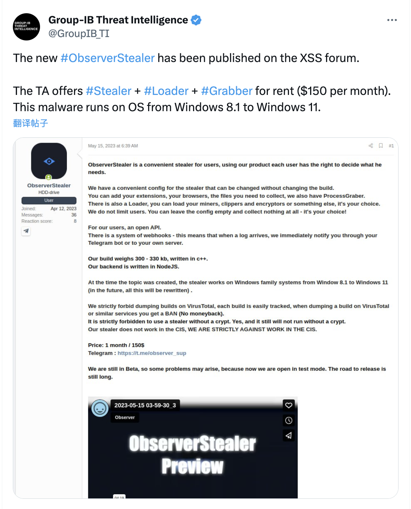

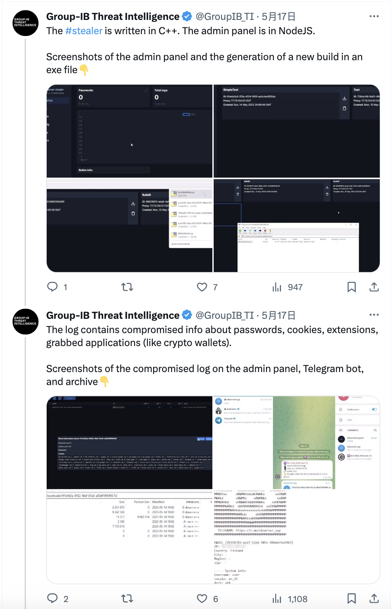

**Trojan Sample Analysis**

 
After searching for the keyword "Observer Stealer" on the app.any.run analysis platform, we found three trojan samples.

After a preliminary analysis of the samples, we found that they will perform operations similar to authentication, and then load DLL execution from an external server. 

Then, they will continuously send TXT and image documents to the external linked address.

Through these three samples, we obtained related paths and initial C2 addresses. Research has also found that these trojans have different attack behaviors, which shows that not only one team is performing these operations.


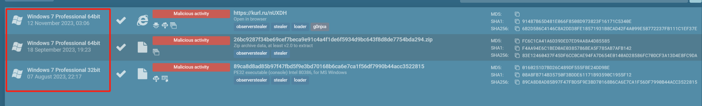

```
path:          
/freebl3.dll          
/libcrypto.dll          
/mozglue.dll          
/nss3.dll          
/mozglue.dll          
/softokn3.dll          
/sqlite3.dll
C2:          
http://5.42.64.13:3000          
http://5.42.64.41:1337          
http://91.103.252.17:8912
```

## Use FOFA for Search

After the above few methods, we obtained some samples. Next, we will use FOFA to try to further expand the assets and obtain more unknown assets of this malware.

**Clue 1:** Search from the obtained favicon and get 4 data.

[icon_hash="-1529439559"](https://en.fofa.info/result?qbase64=aWNvbl9oYXNoPSItMTUyOTQzOTU1OSI%3D)

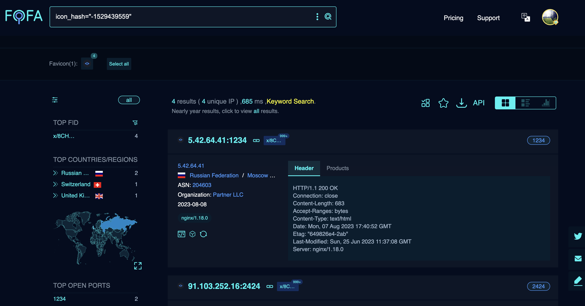

**Clue 2:** The C2 address feature of the sample

Every time the sample trojan loads the DLL remotely, it needs to be verified once, and if it is firmly failed, it will display 404. Through this IOC, we found these two features.

[ip="5.42.64.13"](https://en.fofa.info/result?qbase64=aXA9IjUuNDIuNjQuMTMi)

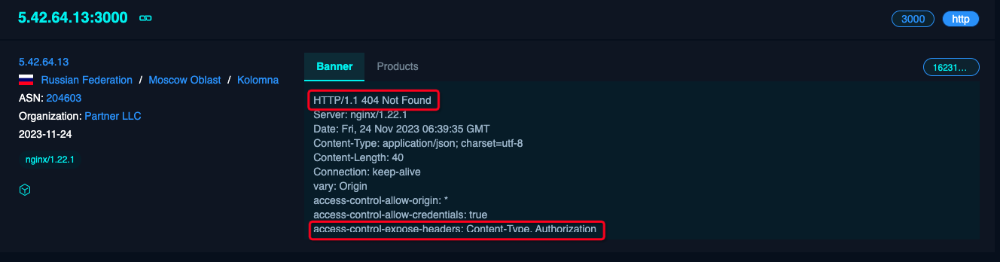


The search syntax can be obtained by splicing these two features, but the result is a bit too much, which is not normal.

[banner="access-control-expose-headers: Content-Type, Authorization" && banner="404 Not Found"](https://en.fofa.info/result?qbase64=YmFubmVyPSJhY2Nlc3MtY29udHJvbC1leHBvc2UtaGVhZGVyczogQ29udGVudC1UeXBlLCBBdXRob3JpemF0aW9uIiAmJiBiYW5uZXI9IjQwNCBOb3QgRm91bmQi)


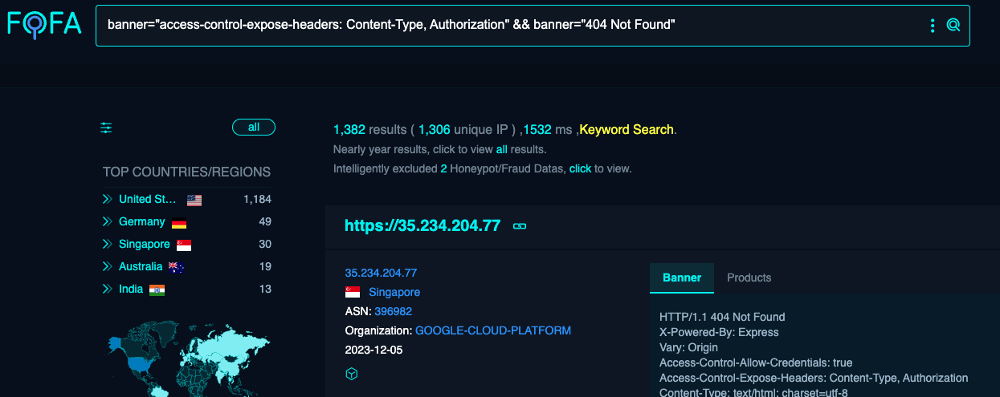


We calmed down and re-analyzed. If all the behaviors are loaded through this platform, then the content of its 404 return page each time should be the same, so the length information can also be extracted, and only the assets that meet the three features are what we are looking for.

The newly generated syntax has 6 addresses and 5 independent IPs.

[banner="access-control-expose-headers: Content-Type, Authorization"&&banner="404 Not Found" && banner="Content-Length: 40"](https://en.fofa.info/result?qbase64=YmFubmVyPSJhY2Nlc3MtY29udHJvbC1leHBvc2UtaGVhZGVyczogQ29udGVudC1UeXBlLCBBdXRob3JpemF0aW9uIiYmYmFubmVyPSI0MDQgTm90IEZvdW5kIiAmJiBiYW5uZXI9IkNvbnRlbnQtTGVuZ3RoOiA0MCI%3D)

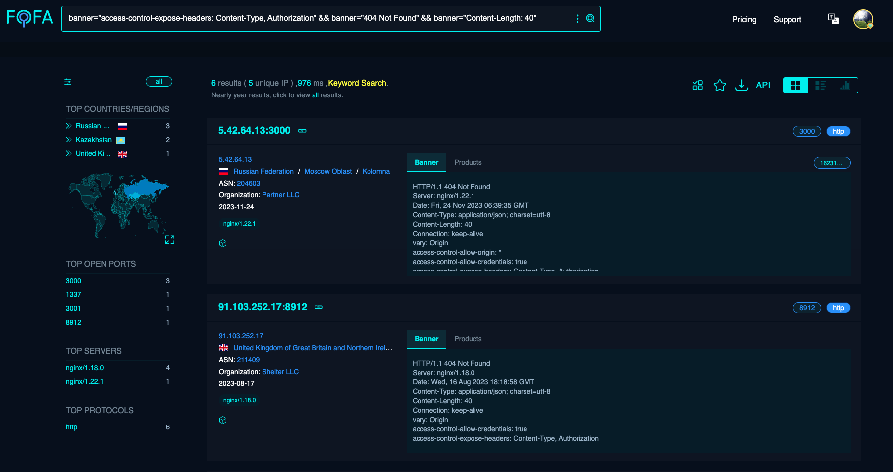


After getting these assets, you can continue to query on the sample website to see if this will find more clues.

**Result 1** 

5.42.64.13: The earliest sample time is June 13, 2023. The feature of this sample is that the same process uses other C2 addresses to download exe executable files and upload txt documents.

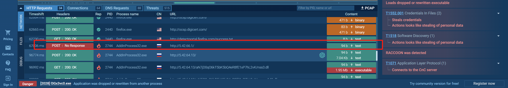

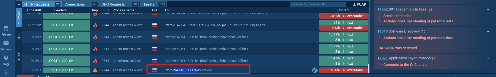


The C2 address associated with it is:

```
5.42.66.1          
94.142.138.116
```

**Result 2** 

5.42.64.41: The earliest sample time is June 5, 2023. It is a new way of utilization. It will download and run malicious files through the way of shared file platform.

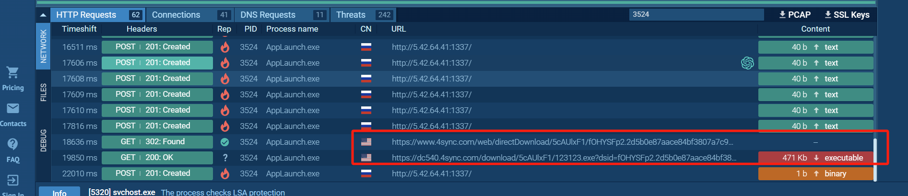

https://www.4sync.com/web/directDownload/5cAUlxF1/fOHYSFp2.2d5b0e87aace84bf3807a7c917adfb0d

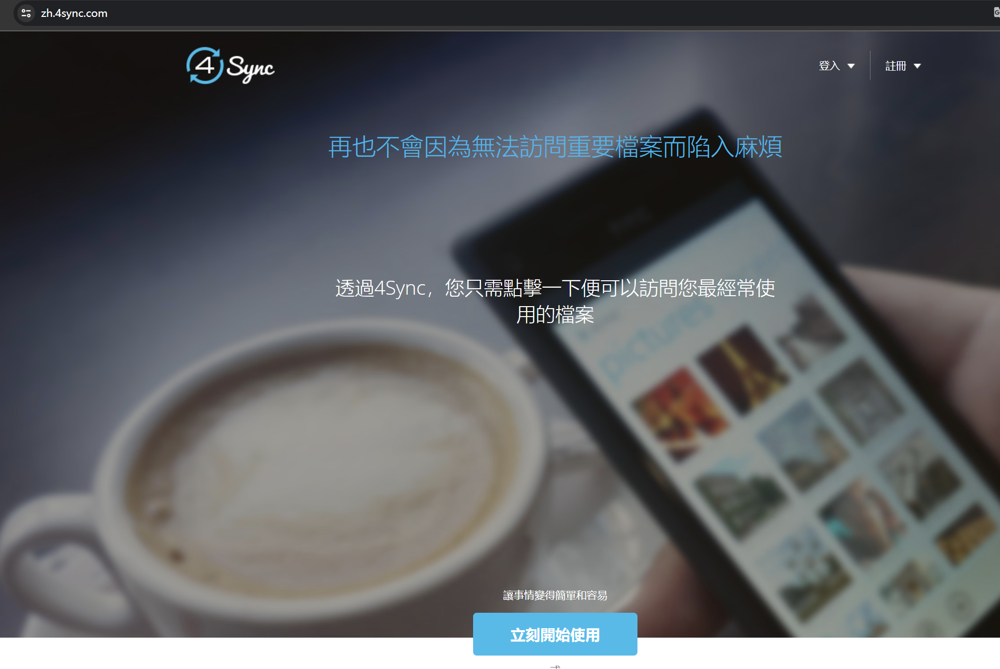

**Result 3**    

91.103.252.17: The earliest sample time is July 4, 2023. I found a different way of use from the above two results. It will load malicious files through the whitelist windowsupdate.com and godaddy.com for secondary use.

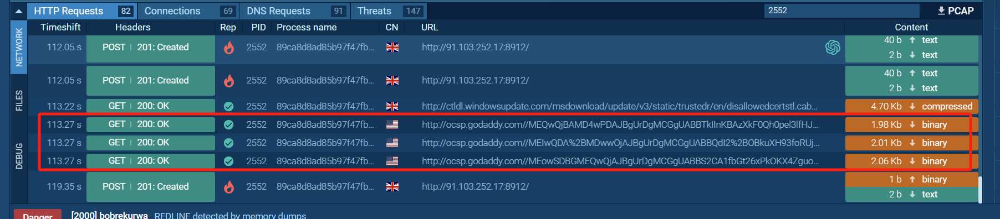

**Result 4** 

77.73.134.51: The earliest sample time is May 15, 2023. This IP directly corresponds to the time and IP of the observer stealer organization demonstrating the platform.

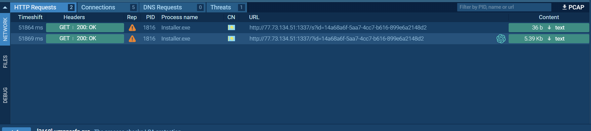

Why choose these few result IOCs for analysis? Because they are very representative and can draw interesting conclusions.

According to the attack method and timeline (basically the first batch of sample data appeared from June to July), it can be judged that these IPs are not the same team. 

It is preliminarily judged that three different teams are spreading the trojan through this platform.

And by analyzing the trojan behavior, it is found that the trojan has a remote control function after the version in May, which can control the download or access to the mounted file.

We just found two useful IPs through the trojan association, which can be further expanded on FOFA.

First start with 5.42.66.1, found the familiar open port 3000, according to the results of related samples close display, this program visits the myliunx service mounted on port 80.

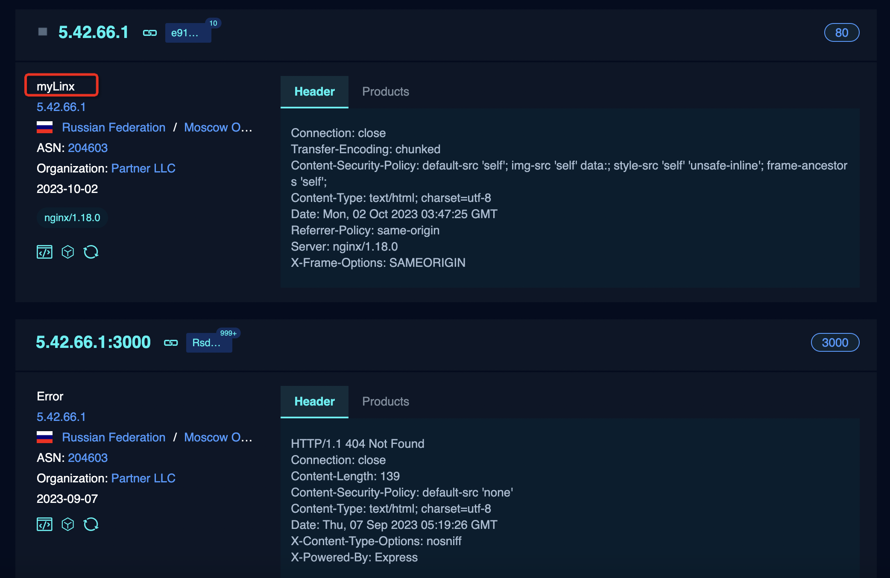

Now we know that this team usually loads DLLs through port 3000 and uses port 80 to POST file utilization. So, combining these two features, let's first search for results through the title and port 80.

There are 8 assets, 6 independent IPs.

[title=="myLinx" && port="80"](https://en.fofa.info/result?qbase64=dGl0bGU9PSJteUxpbngiICYmIHBvcnQ9IjgwIg%3D%3D)

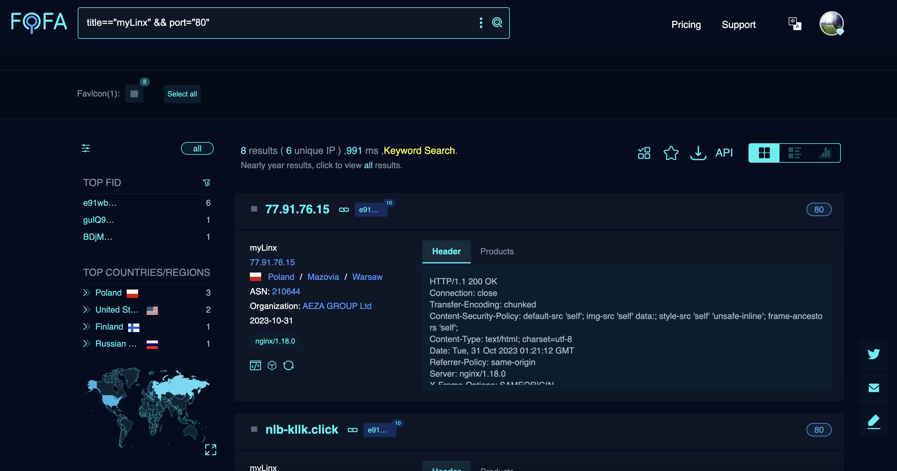


```
77.91.76.15          
5.42.66.1          
104.21.76.48(cloundflare)          
172.67.187.177(cloundflare)          
208.113.165.34          
135.181.213.164
```

We removed the cloundflare assets and checked whether these 4 IPs opened port 3000 respectively.

We found that the IP belonging to the Eastern European region has opened port 3000. Combined with our previous conclusion on the behavior analysis of the virus: a verification is required before remotely loading the DLL, so the return packet of port 3000 should be 404.

So it's basically confirmed that 77.91.76.15 and 5.42.66.1 are other C2 addresses of this team.

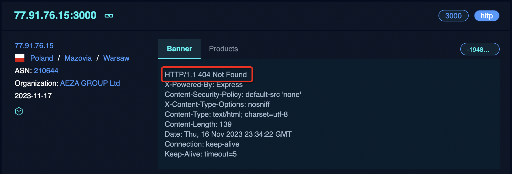

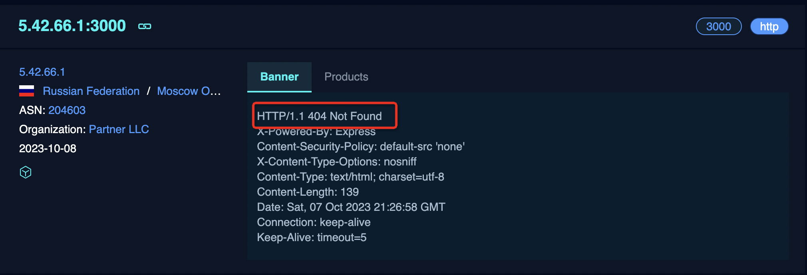

Now, let's look at the second associated IP, 94.142.138.116. By searching on FOFA, we found it's a nginx service, which doesn't match some of the features we summarized above. However, surprisingly, port 8081 of this IP has deployed RisePro, which we suspect is a control machine for this team.

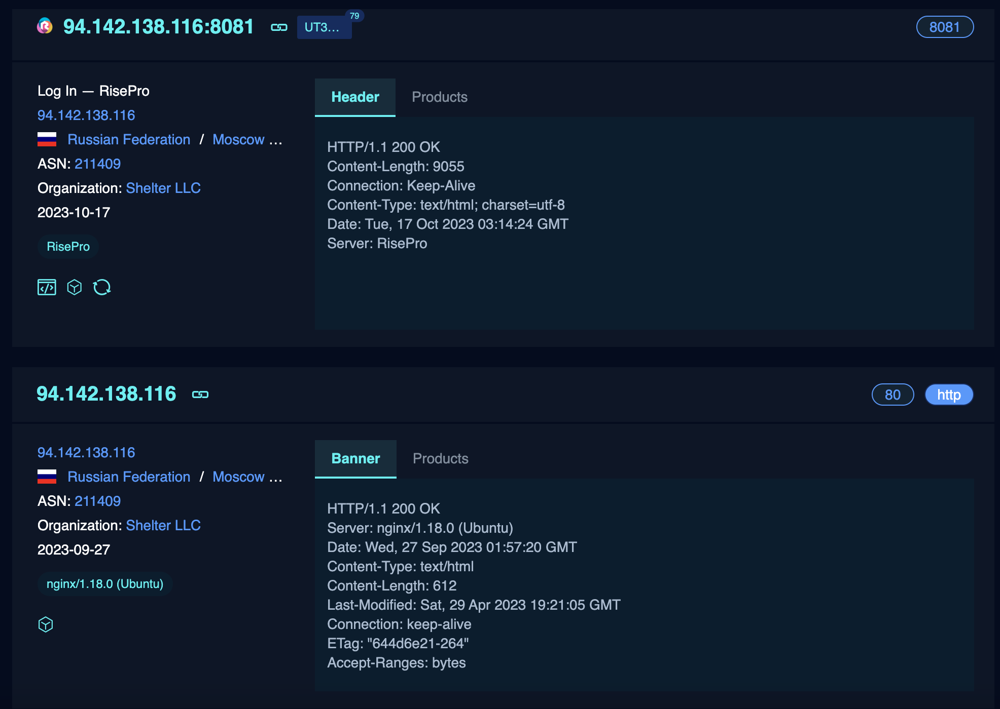

```          
77.91.76.15          
5.42.66.1                   
94.142.138.116
```


## Summary

Through this case, we can see that the wiretapping analysis is not just a simple query. It requires a detailed understanding of the attack behavior of the virus or the asset behavior of the organization, and then uses this as a clue to continuously expand the search, so as to get more results.

In addition, we can also see that attackers' methods are constantly changing. They can not only use a variety of ways to spread viruses, but also use a variety of attack methods to bypass detection. Therefore, it is necessary to maintain a high degree of vigilance at all times, update the detection methods in time, and enhance the security awareness of employees in the organization.

## Indicators

```
DLL path          
/freebl3.dll          
/libcrypto.dll          
/mozglue.dll          
/nss3.dll          
/mozglue.dll          
/softokn3.dll          
/sqlite3.dll
```

```
C2:          
5.42.64.41:1234          
179.43.155.205:81          
91.103.252.16:2424          
91.215.85.38:1234          
5.42.64.13:3000          
91.103.252.17:8912          
91.215.85.38:3000          
5.42.64.41:1337          
77.73.134.51:3000          
77.73.134.51:3001          
77.91.76.15          
5.42.66.1          
94.142.138.116
```

```  
Trojan hash MD5：          
3a4bd9f63354d5c840069528f2245b8a          
94a5c959239a6cd8f580e5f088552369          
57cebb3b7e7f6362fd8282c0a62e8ed9          
8daeb676138ec7a6173f8cae4d9b5146          
9213ec7fc25ac1f8e2fb318bb2d399e7          
e5dbe60dbe305d5b512a93c80f2575ad          
be266f86c6927fedc41f106002e6c9c2          
fd72250981f4893adf7b46f44d41444d          
fc6c1ca41a6d39ded7ed9aa8a4d85585          
781b967891fc70a56149bf82dfad4fa4          
508971e96c961d6b88d56701cd189bb2          
1780096fea2ee66aedd59718c7686f15          
298b4efda09bf8d79b5deb84ca87fbae          
7f8d6ce69e8b0d9c09208ad39b1d1440          
d382782d8fa8574354ac6033f95eb5ca          
df3795e6842e839cf45e694b7164ee17          
bee39fe76d04c610256938a58ac5d660          
d86704134f65f0ebe87032f76864db5a          
df3795e6842e839cf45e694b7164ee17          
c28cc92a7c78b96bec58fa3e5398074a          
21001efc52912f4fac0ec8b4a5837313          
88344d191754f08133b2e798b836638d          
c31d52eb807ac1b269d66ceafa3012b9          
d6b12bcfdf067e283a062a542d96c6e0          
0160251d7bd26c489df555fbe24dd9be          
59565c1d8b5fd88759ea9e225379783b          
e884f6eec5e4ab58a189203001c6acc9
```

## Reference

https://www.antiy.cn/research/notice&report/research_report/ObserverStealer_Analysis.html

https://twitter.com/TLP_R3D/status/1662508869665402880

https://twitter.com/GroupIB_TI/status/1658805021880795136

https://medium.com/@cyberhust1er/observerstealer-unmasking-the-new-contender-in-cybercrime-6e54a40d801d