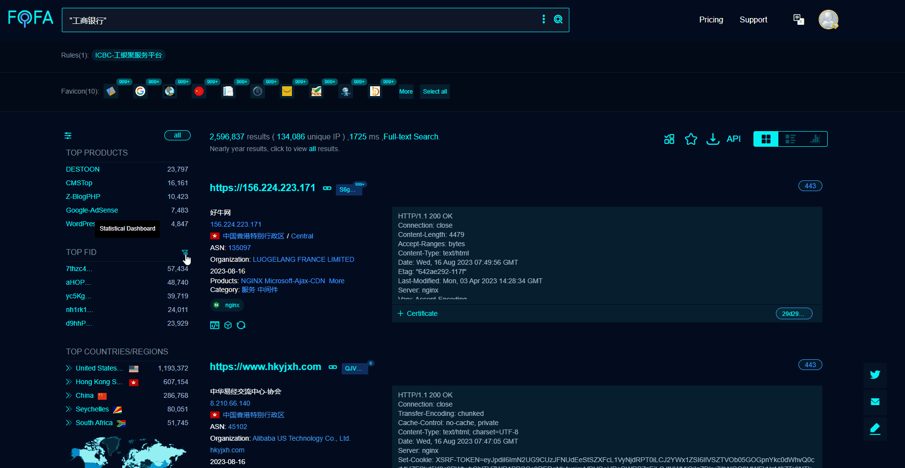
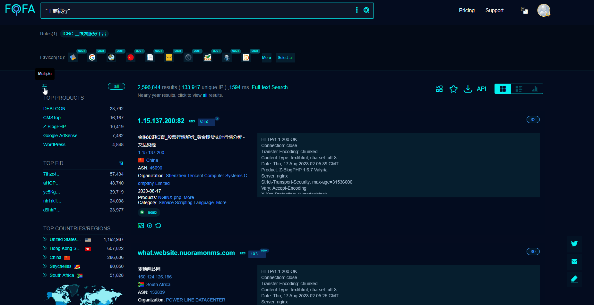

# 提升FOFA搜索效率的新途径

## 写在前面
在使用FOFA搜索过程中，往往通过结果页的聚合信息进行条件的筛选是非常有用的，可以快速的添加自己所需要的条件。但是不管是FOFA工程师的使用反馈还是前一段我自己在资产梳理的时候都发现了大的问题！

 

FID（FeatureID）是我们FOFA自己打的指纹信息，本身一长串的字符并不具备任何参考价值。我需要打开新的页面查看才知道这个FID到底代表的是哪一类的网站，以及它到底是不是我所需要的目标网站，极大的拉长了我在资产梳理时所浪费的时间。另外，聚合信息直接只能进行添加，不能排除。我点击之后自动会进行 && (和）的添加，我查看完发现不是我所需要的内容的话需要排除该条件，重复地进行同样的操作，我可是要励志成为鼠标猴的，不能点点点也太不爽了！

 

所以由此引入了新的思考，该如何最大化地缩短通过聚合统计筛选，尤其是像FID这样的信息判断的时间呢？

 

## 功能实现
我们尝试对FID指纹进行预览操作。通过按钮打开弹窗，让结果页所聚合的FID指纹进行二次聚合，通过查看他的所有信息来进行FID结果预览，快速判断后进行添加或筛选。
 

好消息：功能实现了！坏消息：分钟级响应... 我要它何用？有这时间我都通过以前的方式搞完了。

 

由此引入了第二次思考，我需要解决的场景和目的是什么？

 

我需要预览这个FID对应的都是些什么网站，以此来快速判断这个FID特征我要还是不要。我是否需要查看它所有的聚合特征呢，什么特征可以快速地帮助我进行判断呢？

 

我们重新梳理了需求和最终实现的目标。可以快速做判断的特征选取：网站标题、主域名、IP段。取样Top2进行聚合展示，发现完全满足我快速做判断的需求。

 

说了这么多，我们直接看这个功能是怎么用的吧！

查看➡️多选➡️一键排除，敲什么键盘？不用敲！快速排除站群数据。

除此之外，另一个功能就简单的多了。直接添加了多选操作的按钮，多选添加或多选排除即可，直接点鼠标就完事了。像这样：

 

## 总结
理解用户，像用户一样思考，以及致力于帮助用户解决问题，以便更好地使用我们的产品是我们一直在做的事情。在功能实现的过程中，我们也碰到了一些挑战和走一些弯路。但是，一旦我们明确了业务目标，重新审视问题，就会发现没有什么是解决不了的。实际上，有时候最简单的方法往往就是技术实现。这种坚持和重新思考，是我们在这个旅程中的动力所在。