# 用FOFA进行一场APT Bitter追踪的实战

## 写在前面

在使用FOFA进行资产扩展时，我们可能会遇到一种情况，即当目标资产没有明显的有效关键特征时，我们可能会不知所措，不清楚如何进行下一步的操作。如果我们只是提取关键字段特征，那可能并不足以达到我们的最终目标。因此，这次分享将以一次实战为例，从初始的一点信息（或称之为"开局一个碗"）出发，结合丰富的经验和方法，我们通过多角度识别，揭示了该APT组织更多的存活资产。

## 线索分析思路

首先，我们通过社交媒体看到了一个白帽子 [suyog41](https://twitter.com/suyog41/status/1717061493068640648) 发现的域名Indicators of Compromise（后续简称IOC），除此以外别无他物。

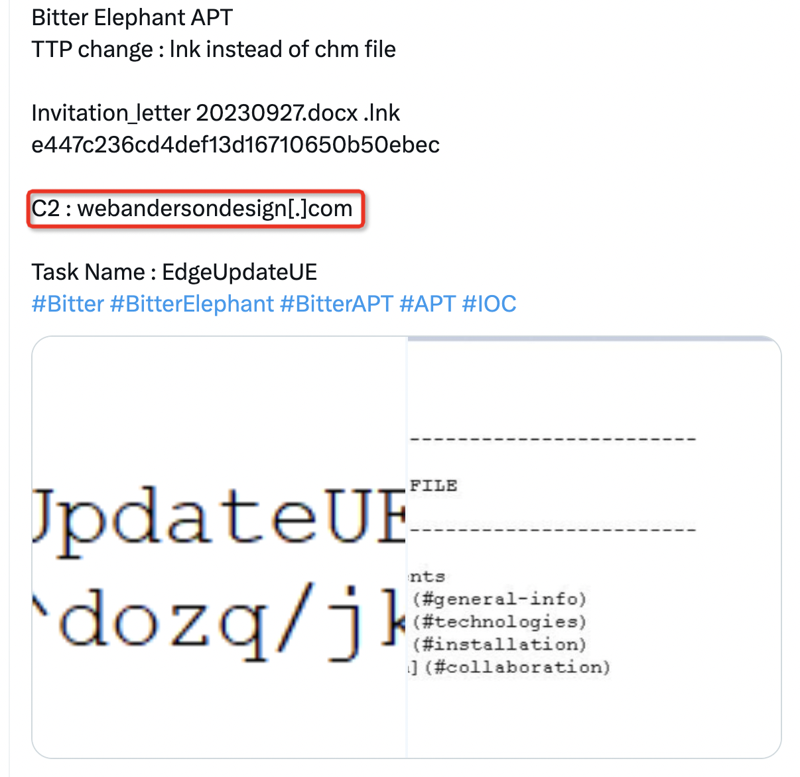

```
webandersondesign.com
```


我们今天就根据已知的内容，在互联网上发现同团伙的更多存活的资产信息。

[FOFA](https://en.fofa.info) 起手，发现它存在不明显的特征，多为403状态，开放443端口且拥有过证书。    

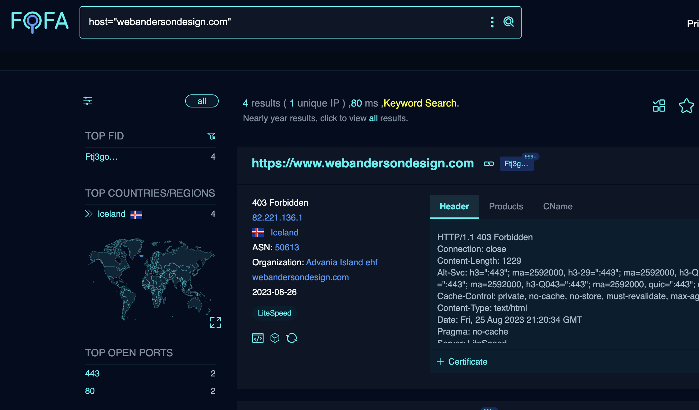   


无法直接提取出有效特征，直接用原始特征进行搜索数量太大。


不过第一步我们需要进行二次确认，该资产所对应的相关组织是否准确。对其域名[微步](https://threatbook.io/)进行查询，查找更多的有效信息。可以看到以下结果，通过查询确认这两条为APT蔓莲花组织（APT Bitter）的IOC。

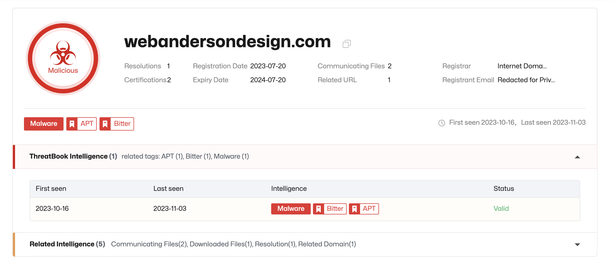


除此之外，通过谷歌搜索还发现，有开源项目[maltrail](https://github.com/stamparm/maltrail) 收录了该IOC信息，它的作者是[Mikhail kasimov](https://twitter.com/500mk500) [Maltrail](https://twitter.com/maltrail)

https://github.com/stamparm/maltrail/blob/master/trails/static/malware/apt_bitter.txt

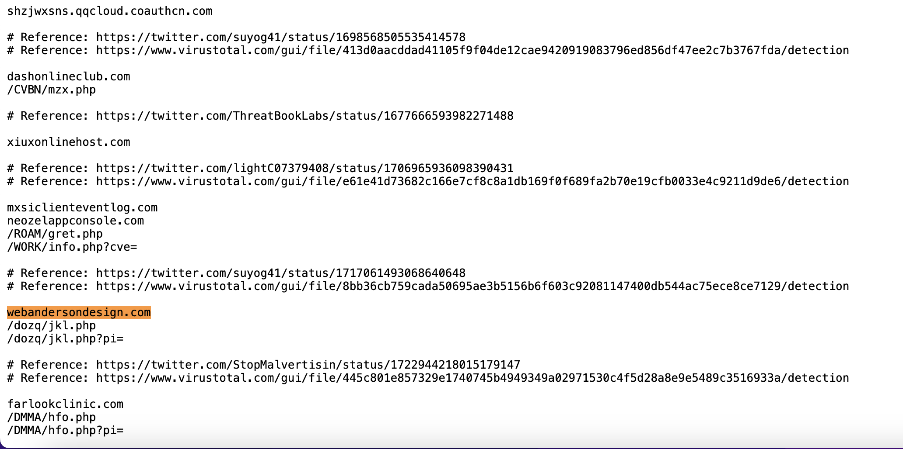


有超过两条以上的IOC信息后，接下来就是对多条IOC的进行共性特征提取，这一步的整体思路是对比两条IOC的共性部分，例如title、body、cert等。

同时通过公开资料显示该组织主要的攻击手法是通过钓鱼发送OFFICE文档类的加载，所以IOC提取到的域名其实是放木马的载体。通过分析发现木马的下载链接特征都为：

**域名/随机的二级目录/随机名的php文件？参数=username*computername**

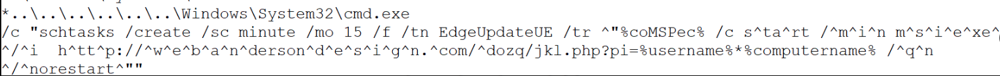


我们通过对公开的样本进行分析，得出他们在FOFA上特征表现如下：

```
1. 首页标题特征都是 title="403 Forbidden"
2. Server 头信息：server="LiteSpeed" 
3. 响应头大小：header="Content-Length: 1229"
4. 备选服务头：header='"Alt-Svc: h3=:443"'
```


不过其实发现，这些通用特征的范围太大了，属于LiteSpeed的通用特征。


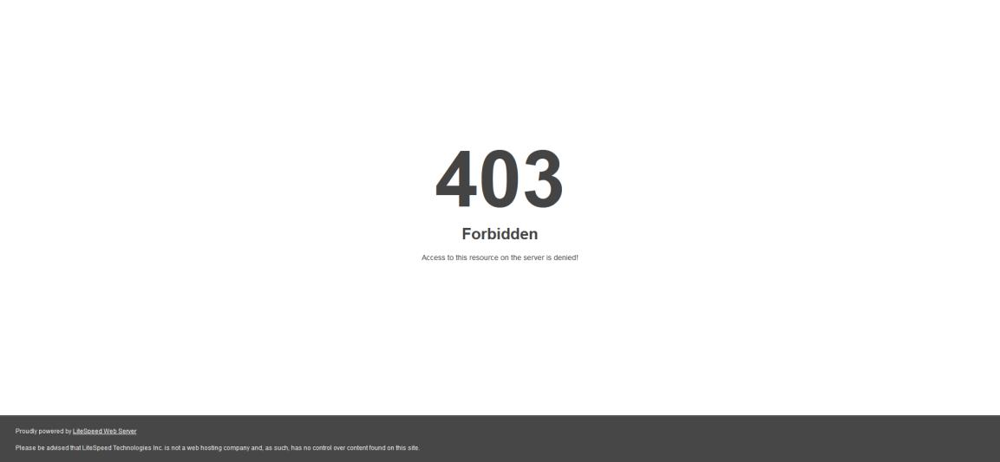


不要灰心，重点来了，我们看看还能提取到什么有用的特性。通过对比分析发现了更多的线索：

```
1. 它们的服务行为特征一定会开放80,443（SSL）
2. 域名一定会设定CNAME
3. 证书属于免费证书，且证书一定为有效证书没有过期
4. 且证书subject一定会绑定一个域名
5. 网站都没有Favicon图标
```


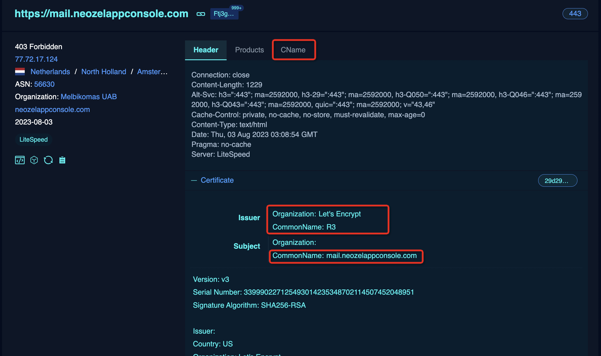


所以我们先整合以下手头整理的这些特征，先进行已知特征的拼接。

```
header='Alt-Svc: h3=":443"' && title="403 Forbidden" && header="Content-Length: 1229" && port="443" && server="LiteSpeed" && cert.issuer.cn="R3"
```

特征排完了，然后加上他的特性，这里每个特性对应的FOFA语句进行单列。

```
1. domain!="" (域名不为空值)
2. cert.is_valid=true (证书可信）
3. cert.is_expired=false (证书没过期）
4. icon_hash="" (Favicon图表为空值)
5. cert.subject.cn*="*.*" (证书持有者一定会绑定域名）
6. cname!="" (CName不为空值)
```


这里先做一个初步语法拼接，所以取近3个月的数据，所以再加上一个`after="2023-08-01"`
初步的语法拼接结果如下：

```
header='Alt-Svc: h3=":443"' && title="403 Forbidden" && header="Content-Length: 1229" && port="443" && server="LiteSpeed" && cert.issuer.cn="R3" && domain!="" && cert.is_valid=true && cert.is_expired=false && icon_hash="" && cert.subject.cn*="*.*" && cname!="" && after="2023-08-01"
```


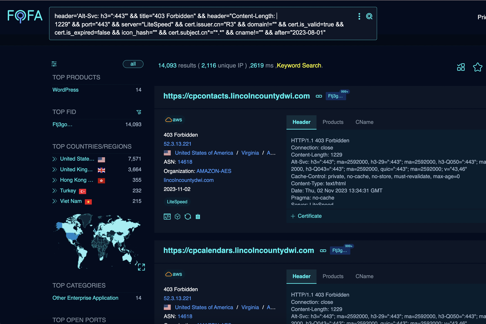


保险起见，我们要对以上的语法进行验证特征提取的正确性，确认和样本是不是包含关系。

所以加上`host="webandersondesign.com"`

```
header='Alt-Svc: h3=":443"' && title="403 Forbidden" && header="Content-Length: 1229" && port="443" && server="LiteSpeed" && cert.issuer.cn="R3" && domain!="" && cert.is_valid=true && cert.is_expired=false && icon_hash="" && cert.subject.cn*="*.*" && cname!="" && after="2023-08-01" && host="webandersondesign.com"
```


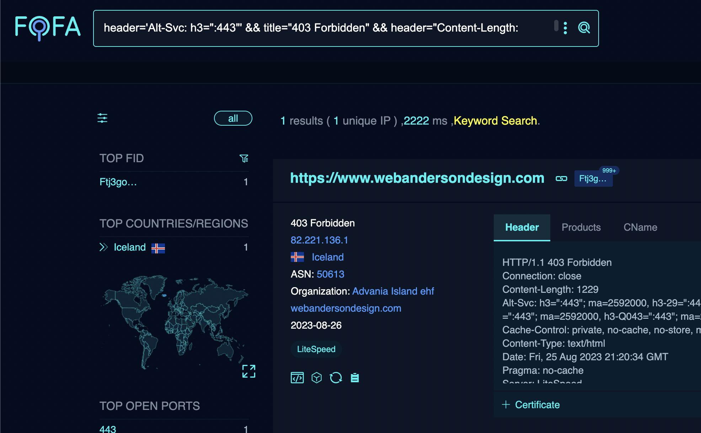


目前的结果范围还是比较粗旷的，下一步可以对其公开的样本继续进行分析。

通过分析发现，该组织放木马的机器都为共享的web空间，属于注册账号就能开通web服务而非单独的服务器权限（表现为绑定了多个域名），我们对现有样本的组织（Org）信息进行统计分析，这里可以看出该组织会固定在几个服务商去购买web服务进行投放。

公开样本地址：
https://raw.githubusercontent.com/stamparm/maltrail/master/trails/static/malware/apt_bitter.txt

将其公开的相关组织信息整合进我们的语法，如下，有839条资产和208个独立ip：

```
header='Alt-Svc: h3=":443"' && title="403 Forbidden" && header="Content-Length: 1229" && port="443" && server="LiteSpeed" && cert.issuer.cn="R3" && domain!="" && cert.is_valid=true && cert.is_expired=false && icon_hash="" && cert.subject.cn*="*.*" && cname!="" && (org="ARTERIA Networks Corporation" || org="Advania Island ehf" || org="HOSTWINDS" || org="Host Sailor Ltd" || org="Akamai Connected Cloud" || org="NAMECHEAP-NET" || org="Iws Networks LLC" || org="Verdina Ltd." || org="AMAZON-02" || org="Melbikomas UAB" || org="GROUP-IID-01" || org="GLOBALCOMPASS" || org="Contabo GmbH" || org="INCAPSULA" || org="Neerja Softwares Pvt Ltd" || org="Commission on Science and Technology for" || org="Belcloud LTD" || org="DIGITALOCEAN-ASN" || org="QUICKPACKET")
```


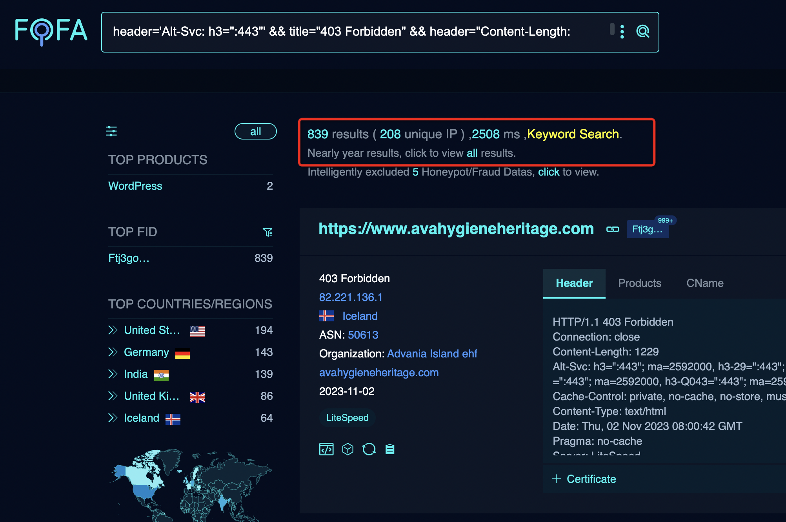

从这里的结果随机去威胁情报平台查询，就取第一条试试，能看到部分域名已经被标注成了蔓莲花组织（APT Bitter）标签或者恶意标签。

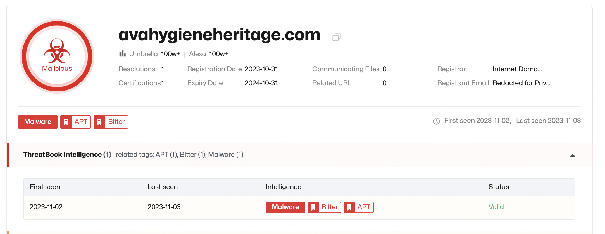


然后最后一步，我们通过公开的样本收集到的URL PATH 进行碰撞匹配。

样本地址：
https://raw.githubusercontent.com/stamparm/maltrail/master/trails/static/malware/apt_bitter.txt

这里用到的工具是fofax，工具下载地址：

https://github.com/xiecat/fofax

具体碰撞语法如下：

```
fofax -q ' header="Alt-Svc" && title="403 Forbidden" && header="Content-Length: 1229" && port="443" && cert.is_valid=true && cert.is_expired=false && icon_hash="" && cert.subject.cn*="*.*" && server="LiteSpeed" && cert.issuer.cn="R3" && cname!="" && domain!="" && (org="ARTERIA Networks Corporation" || org="Advania Island ehf" || org="HOSTWINDS" || org="Host Sailor Ltd" || org="Akamai Connected Cloud" || org="NAMECHEAP-NET" || org="Iws Networks LLC" || org="Verdina Ltd." || org="AMAZON-02" || org="Melbikomas UAB" || org="GROUP-IID-01" || org="GLOBALCOMPASS" || org="Contabo GmbH" || org="INCAPSULA" || org="Neerja Softwares Pvt Ltd" || org="Commission on Science and Technology for" || org="Belcloud LTD" || org="DIGITALOCEAN-ASN" || org="QUICKPACKET")' -fs 1000 | httpx -mc 404 -path "/c4ca4238a0b923820dcc509a6f75849b" |seds/c4ca4238a0b923820dcc509a6f75849b//g | httpx -path apt_path.txt -sc -mc 200,403
```

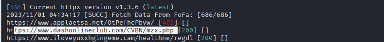

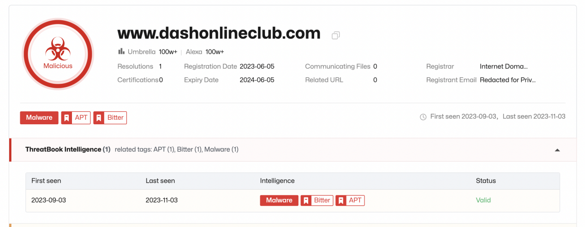

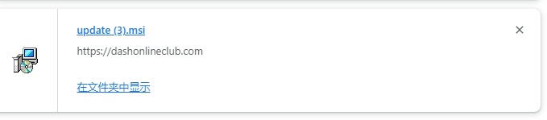


## 总结

这个案例典型的原因有两方面：第一，直接提供的初始信息非常的少；第二，资产没有明显的特征表现。

希望通过这个实战案例所使用的方法能为大家提供一些灵感，尤其是在面对缺乏明显有效特征的资产时，我们如何能够巧妙地运用OSINT工具和FOFA，进行深度信息收集和分析。

在这次的案例所展示的如何灵活运用FOFA的筛选语法，通过分析各种特性，寻找到更多的可能性。尝试了多种方法，如使用等于或不等于空的运算，证书的筛选语法，以及模糊匹配等，这些都是非常有用的策略和方法，通过会达到柳暗花明又一村的效果哦。

总的来说，这个实战案例不仅对于如何处理类似问题提供了具体的操作步骤，同时也为我们面对其他复杂问题提供了有价值的启示。希望大家能从这个案例中获得灵感，学会如何灵活运用这些方法，更有效地解决实际问题。
