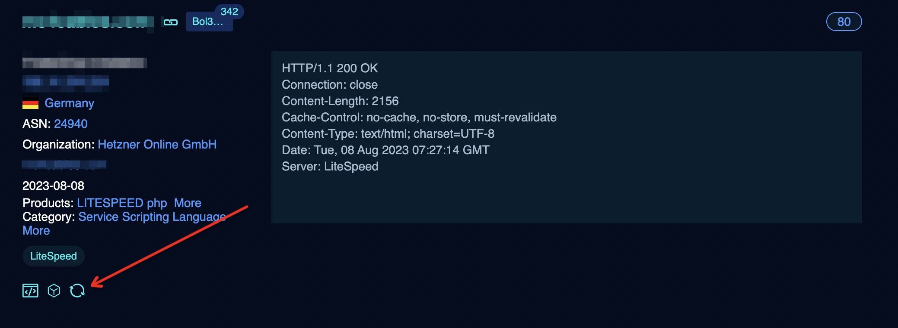

# How to Independently Refresh Your Assets on FOFA?

## Introduction
In our daily work, there's a scenario that often occurs. The friendly FOFA team reaches out to us: "Hello, the assets we used for testing are now indexed by FOFA. Is there any way to hide them?"

This situation can arise due to various reasons. It might be due to improper operations in system maintenance, hasty deployment by development teams, or even internal testing of supply chain components, which unintentionally exposes websites that shouldn't be on the public internet, subsequently being discovered during internet space mapping.

So, what should you do when facing this situation, particularly from FOFA's perspective?

FOFA functions as a comprehensive scanner. Once you update your assets, the current asset information gets overwritten. However, if you hastily delete the asset after receiving a notification, FOFA treats this data as historical and retains it without further updates, keeping it in place.

The standard procedure involves replacing the exposed asset information and waiting for the internet space mapping to scan and update, thus resolving the issue.

But, we're all eager to act promptly. The desire for immediate action is understandable.

This is where the "Force Refresh" feature comes into play. You might have noticed this in FOFA's Bot screenshots – I have a few more buttons than you do, and "Force Refresh" is one of them. It looks like this:

Once, during a meeting with the boss, we discussed the weight and length of the road to network security. Incidents of information leaks occur from time to time, and dealing with them involves identity verification and other processes before scanning can be initiated.

The boss said, "If that's the case, why not make this feature available to everyone? Automate the process to solve this issue!" It suddenly made sense to me – just open up the feature directly!

## How to Use This Feature?
Of course, we can't just open it without any precautions; otherwise, it might even become a potential DDoS vector. So, we've added some minor restrictions – first, you need to prove that the network asset belongs to you.

Therefore, when you click on "Force Refresh," a file will be provided to you. You need to place this file in the root directory of the IP, port, and domain name that correspond to the asset. Once done, click "Force Refresh" again in FOFA, and you're good to go! If your steps are accurate, your asset will be forcibly updated within a maximum of 48 hours.

Hence, the entire process is quite straightforward:

Step 1: Replace the leaked information page with a new page.

Step 2: Click "Force Refresh" in FOFA, retrieve the txt, and place it in the asset's root directory.

Step 3: Return to FOFA and click "Force Refresh" once again.

Done!

This feature is available to all users. Anyone with a registered FOFA account can use it. Of course, even if you're not the king of kings, you can still replace and wait for FOFA's automatic scan refresh. This encompasses the complete process and methods to handle information leaks exposed on FOFA. 