# Practical FOFA Asset Expansion: Unmasking the Trail of the 'Silver Fox' APT

## Introduction

FOFA has a great advantage in asset and clue expansion, but many masters do not understand how to operate and which features should be extracted. Where do the clues that need attention come from? What syntax can be used to implement expansion?

The main problem is the lack of a method and approach to finding clues, and how to apply clues and syntax flexibly to complete asset collection and clue expansion, which is an indispensable important part of network security.

Today we will explore this topic step by step, taking the "Silver Fox" APT as an example, and demonstrate through multiple examples how to use FOFA to further expand sample assets and expand our achievements!

## Case Introduction

"Silver Fox" is a hacker tool that has been widely decentralized and spread. According to Threatbook's research, any attacker can obtain and use it. At present, there are as many as 5 active and publicly known groups detected, and there are more unknown or unpublicized black productions that continue to use Silver Fox Trojans.

The "Silver Fox" Trojan is a malicious software specifically targeting phishing attacks on management, finance, sales, and e-commerce sellers of enterprises and institutions. The attacker obtains computer control permissions through remote control of the Trojan, stays for a long time and monitors user operations, and then uses chat tool software to commit fraud.

There are three common spread paths:

1. **Instant messaging transmission**, using QQ, WeChat, etc. to send inducing files or links.
2. **Phishing website transmission**, disguised as a tax agency website, using WeChat fishing.
3. **Fake software transmission**, disguised as common software, buying traffic to spread on search engines.

This kind of Trojan uses advertising software for bundled promotion, uses complex forms of white utilization, and presents multi-stage delivery methods.
This article will focus on FOFA's expansion capabilities, sharing how to use FOFA to expand the results after getting sample assets.

## Sample Expansion Thought Demonstration

Sample one comes from the 360 Sandbox Cloud Report: "360沙箱提醒您：注意防范“银狐”木马"

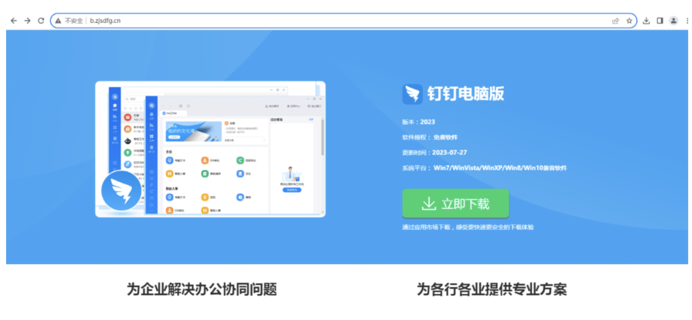

According to the known clues, we obtained the domain name "b.zjsdfg.cn", and its resolved IP address is "211.99.98.76". At the same time, according to the clues in the screenshot, we learned that the original text contains the keywords "钉钉电脑版" and "为企业解决办公协同问题".

Convert these clues into corresponding FOFA syntax queries as follows:

```
ip="211.99.98.76"

body="钉钉电脑版" && body="为企业解决办公协同问题"
```

First, let's use FOFA for IP queries to see if we can find information related to this IP.

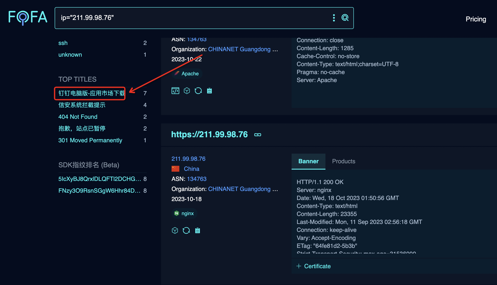

After the IP query, we confirmed that the suspected phishing website title under this IP is "钉钉电脑版-应用市场下载", but this is not our focus.

The key point is that under the same IP, we found new clues: "down.cstny.xyz". You can use the following query syntax to check more information related to this IP:

`ip="211.99.98.76"`

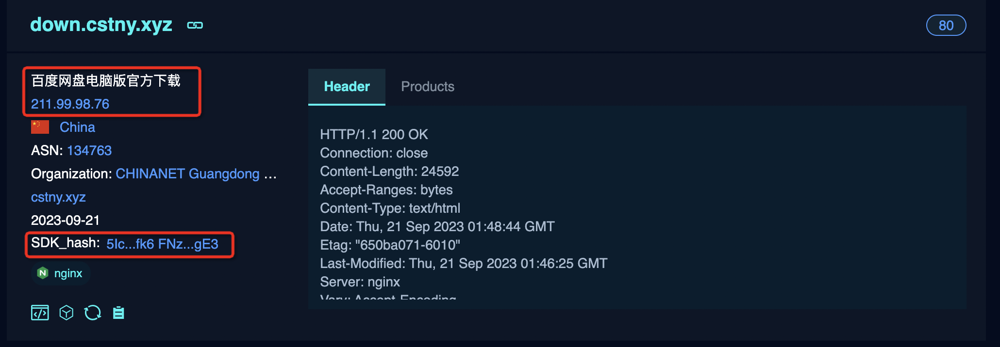

Using the SDK feature of asset association for query, we got 24 records, including 6 independent IP addresses.

`sdk_hash="5IcXyBJ8QrxlDLQFTl2DCHG0Z42JHfk6"`

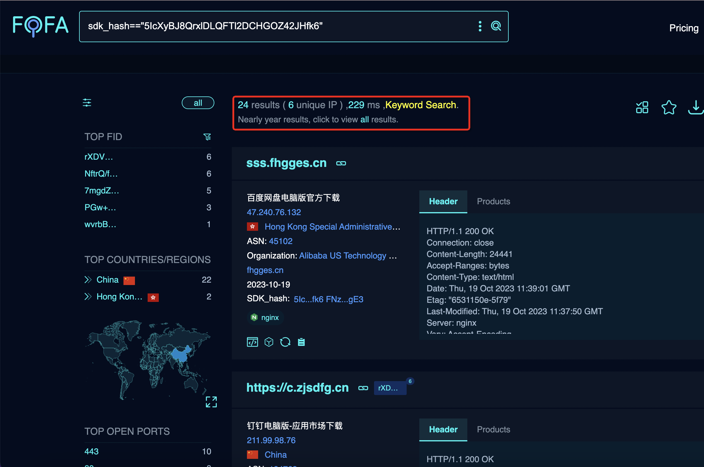

Continuing to dig deeper into its other features, there are 18 assets and 6 independent IPs hit by the keywords in the title and body.

`title="百度网盘电脑版官方下载" && body="模板"`

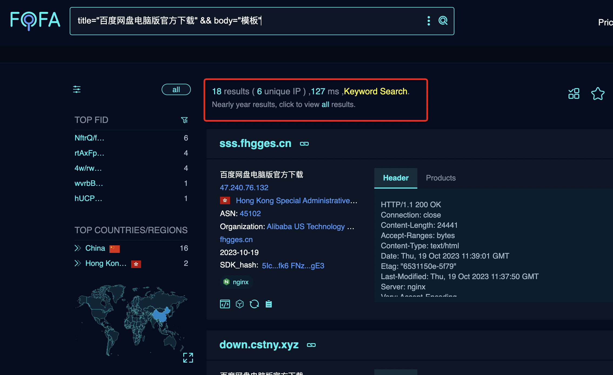

We can see a very interesting trend of change according to the assets we found and the original text of the website saved by FOFA.

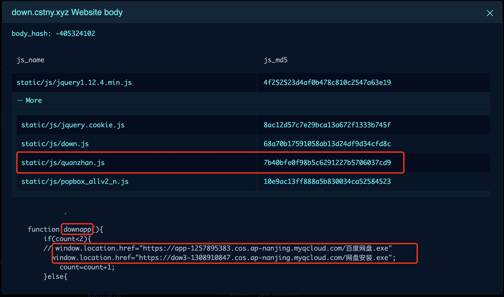

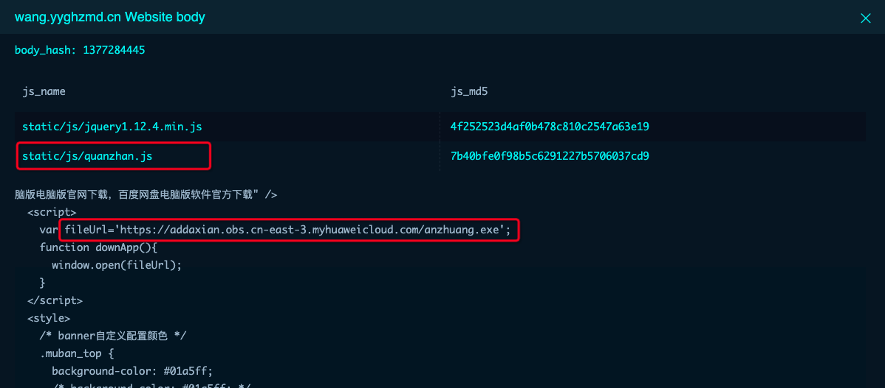

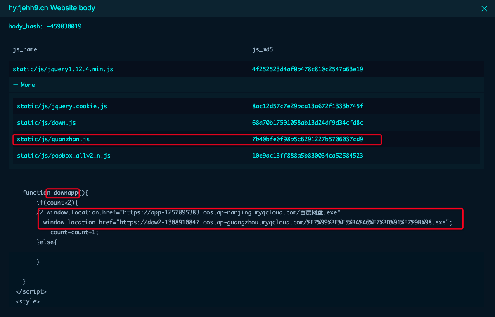


From the original text of the webpage we opened, we can clearly observe the download link of the Trojan and its changes. We can see that it has transitioned from local storage to cloud storage, and in addition, there are obvious similar features.

These similar features can further expand our information collection. In the original information, we can see some notable same features, such as "downapp", "count", "fileurl", etc. In addition, they also share the same "js_name" feature, which has also been revealed.

Therefore, we can continue to use the following search syntax to conduct in-depth queries, and this query result hits 28 data and 7 independent IP addresses.

`js_name="static/js/quanzhan.js" && body="downapp"`

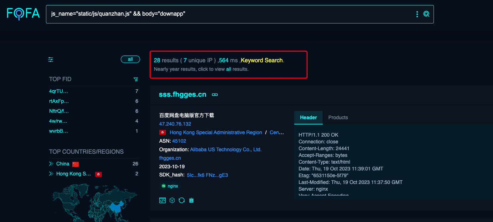


After completing the clue expansion of the IP, we will focus on the second clue, that is, the extraction of the features possessed by the sample original page:

`body="钉钉电脑版" && body="为企业解决办公协同问题"`

And this time according to the results, we found many new feature assets. Through the following title:

`title="钉钉电脑版-鲁大师应用市场下载"`

We got 3 search results, which will help us learn more about "钉钉电脑版".

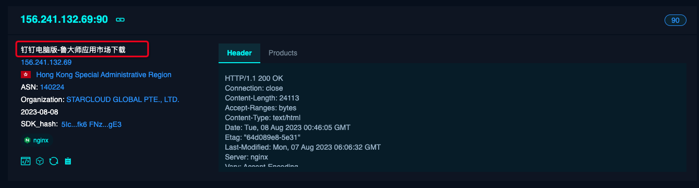

In addition, we also found a new IP address: 43.248.190.199. By searching for this IP, we found new feature clues, among which the new title clue is:

`title="OBS录屏⼤师 _官⽹_简单易⽤的超清录屏软件_电脑录屏⼤师"`

This new clue will help to further expand our information collection and analysis, and get 3 independent domain names.

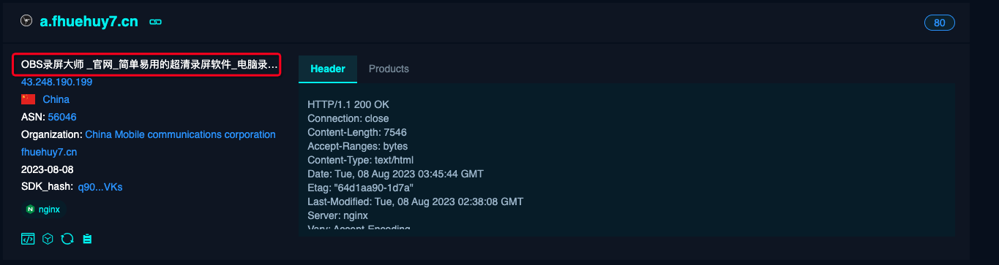

By analyzing the js_md5 value in his body and the common features of this tool discovered above, further syntax concatenation can be performed.

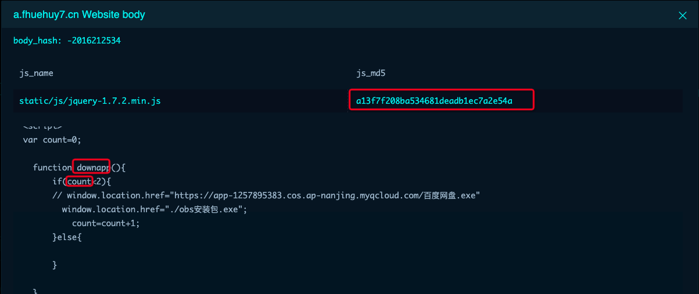

The new phishing website query syntax constructed is:

`js_md5="a13f7f208ba534681deadb1ec7a2e54a" && body="downapp" && (body="count" || body="fileUrl")`

New title clues appeared in the search results. We continue to search using the title syntax, and got 18 independent subdomains and 2 independent IPs.

`title="剪影·拍拍_官⽹_简单好⽤的视频剪辑软件_电脑视频剪辑"`

The retrieved results are as follows:


```
jy15.lianhuawangluo03.xyz
jy.hehuashangwu04.xyz
jy.hehuashangwu01.xyz
jy.lianhuawangluo17.xyz
ad.jianying-pro.cc
jy15.lianhuawangluo09.xyz
jy.hehuashangwu04.xyz
jy.hehuashangwu01.xyz
jy.hecishangwu.xyz
jy.hecishangwu.xyz
jy.lianhuawangluo17.xyz
150.109.76.206
124.156.185.102
jy.hehuashangwu20.xyz
jy1.hehuashangwu11.xyz
jy15.lianhuawangluo09.xyz
ad.jy2023.cc
jy15.lianhuawangluo03.xyz
jy.hehuashangwu20.xyz
jy1.hehuashangwu11.xyz
124.156.134.59
```

When observing this result, we can find some rules, these domain names are mostly combined with "**hehuashangwu**" and "**lianhuawangluo**" followed by two-digit domain names.

So we can use **FOFA's fuzzy search feature** to build a new query syntax, hitting 107 assets and 34 independent IPs.

`host*="*.lianhuawangluo??.xyz" || host*="*.hehuashangwu??.xyz"`

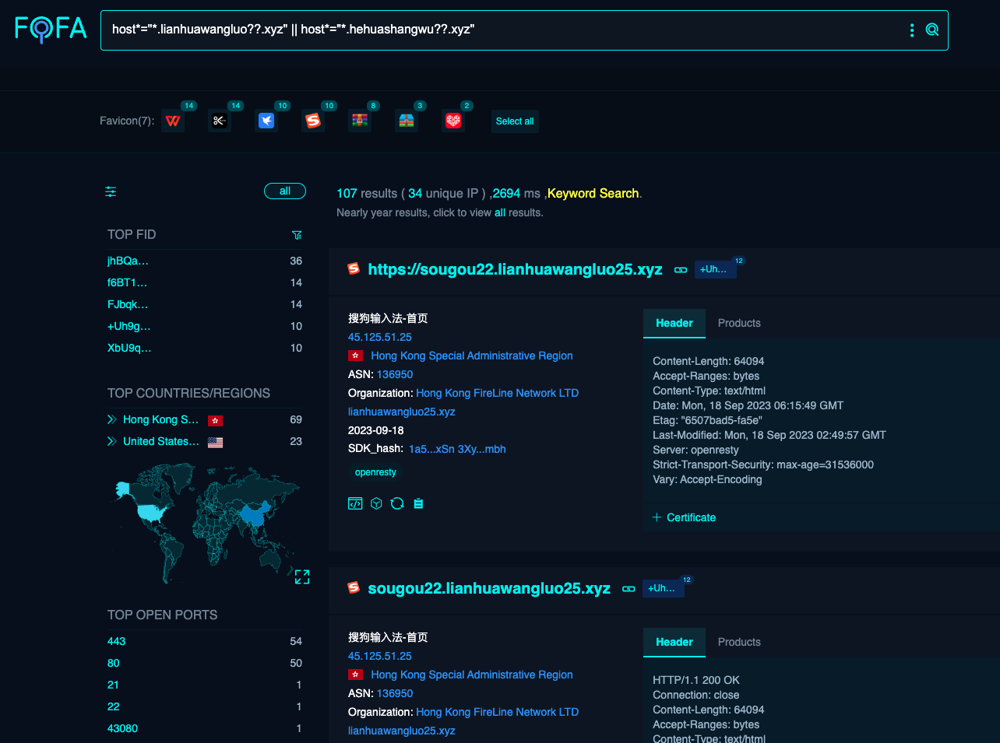

Here, based on the assets of this sample, we have completed a lot of feature extraction. We finally build new syntax based on known features and go all in.

`body="function downapp" && (body="count" || body="fileUrl") && (body="exe" || body="msi" || body="zip")`

Successfully found 136 assets, 35 independent IPs, and more phishing websites appeared in the search results, including Douyin Desktop, WPS, Baidu Cloud Disk, Thunder, winrar, etc., these phishing websites are all disguised as related to this Trojan, this It is an interesting discovery.

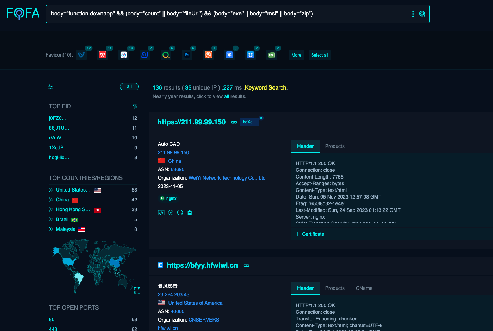

Okay, let's sort out our thoughts and continue to explore another sample.

Sample two comes from the Huorong Report: ”毒鼠”后门病毒再升级 通过伪造官网传播

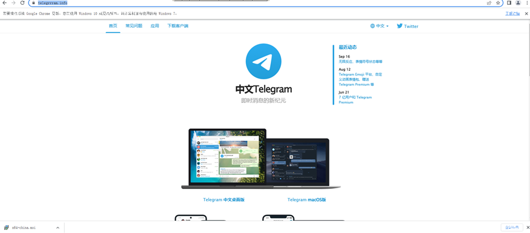

We were able to find information related to this asset through the FOFA platform. This time, we will directly use the fid value marked on the asset for expansion:

`fid="VAaTqhs0Tw/lp4YjN7vWlw=="`

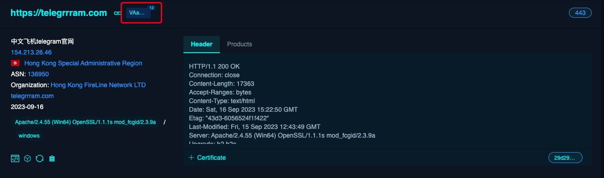

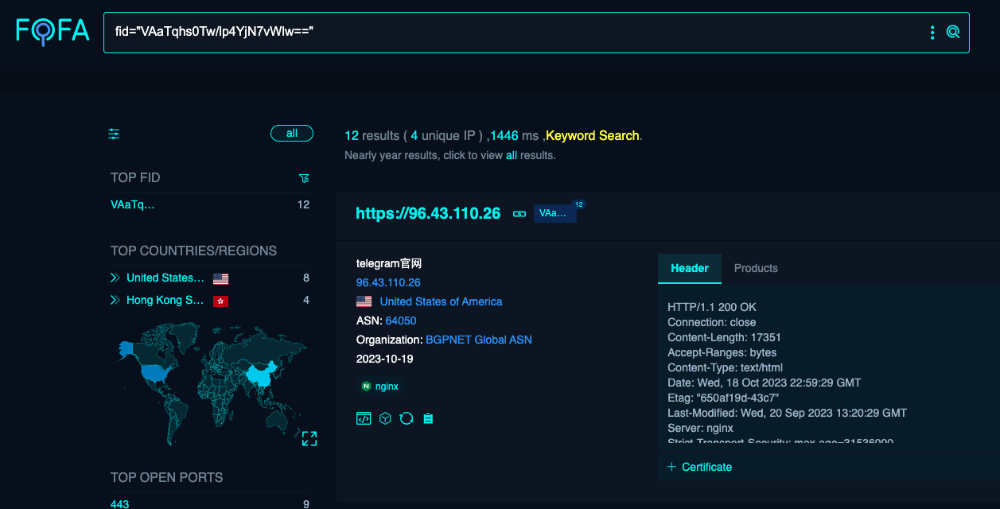

Based on the current asset clues, we successfully queried 12 assets and 4 independent IP addresses. Through this information, we obtained the download address of the Trojan:

`hxxps://vv[i]ipp.xykr[s]ii.cn/tsetup-x64Chinese.exe`

By parsing its IP, we can query the user identity information bound to whois through the open source platform. Of course, today we only use FOFA for clue expansion, so we will not further demonstrate other contents.

We continue to explore sample three, which comes from the Threatbook report: "因势象形：警惕银狐组织发起新一轮钓鱼攻击"


By querying its domain name luthj.sbs, we get the key features of its assets for fission, just like before.

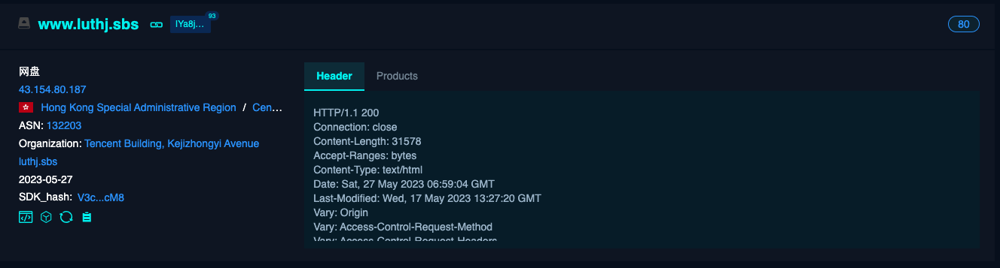

Of course, whether it is through FOFA's unique FID fingerprint, or using the SDK features mentioned above, you can further expand the clues. This time we choose to extract the key features in his body information.

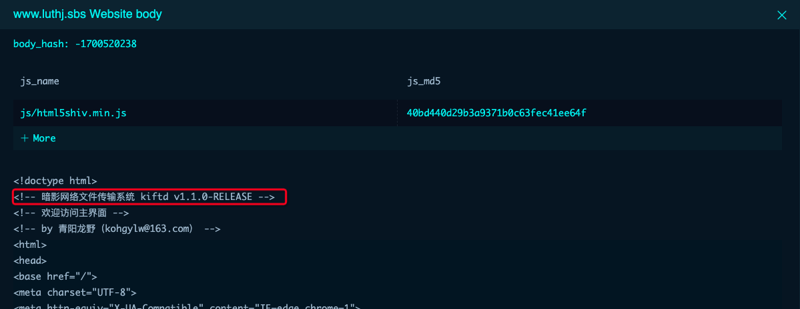

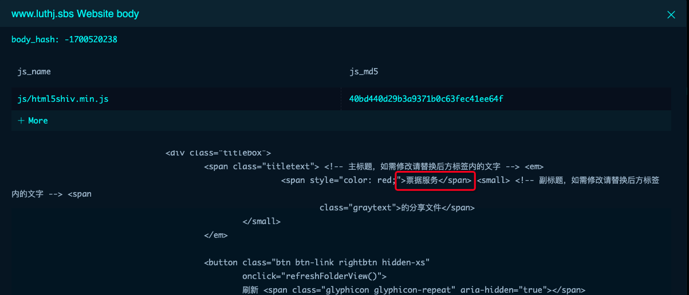


Based on the extracted features, we generated the following search statement and found 109 results and 10 independent IP addresses.

`body="暗影⽹络⽂件传输系统 kiftd v1.1.0-RELEASE" && body="票据服务"`

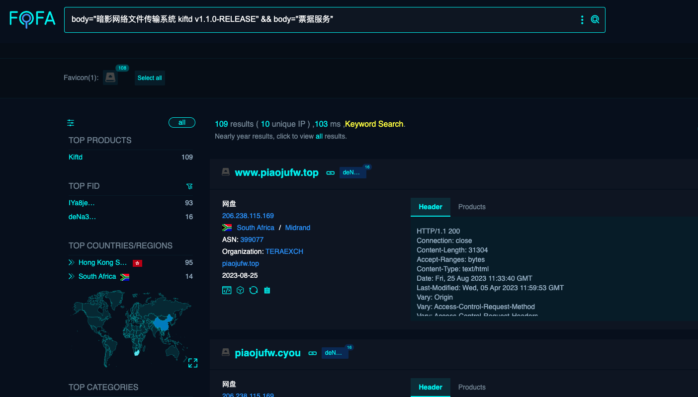


# Conclusion

The Silver Fox tool is widely used. Its main idea is to create phishing websites by disguising as common software download pages, and then send them to the victims' mailboxes through phishing emails, inducing them to download Trojan files.

Through the expansion of a series of asset discoveries, some related phishing website domain names follow certain rules, and you can expand the line to the corresponding phishing website assets based on these rules.

In addition, different types of phishing websites usually contain the same keywords, such as "js_name" or "downapp", which indicates that these phishing websites may come from the same organization.

In this real Silver Fox case analysis, we used a variety of FOFA query syntax, including syntax ip, body, host, sdk_hash, title, js_name, js_md5, fid and fuzzy matching function, to perform asset expansion.

The entire expansion process depends on the powerful search function of FOFA, but the more important thing is the method of finding clues and thinking. I hope this case can help masters to better use FOFA for asset expansion and information collection, and maximize the value of FOFA.

**The results of deduplication after this case are as follows:**

```
103.143.159.111
103.143.159.94
103.143.159.98
103.15.104.242
103.163.46.172
103.253.13.59
103.36.166.149
104.21.15.115
104.21.16.191
104.21.30.24
104.21.33.112
104.21.4.219
104.21.44.41
104.21.50.201
104.21.63.17
104.21.67.152
104.21.83.241
104.21.89.234
110.42.2.115
114.134.189.99
114.29.254.8
114.29.255.45
121.37.160.16
123.60.48.116
124.156.134.59
124.156.185.102
150.109.68.68
150.109.76.206
154.213.26.46
156.241.132.69
172.67.130.220
172.67.140.212
172.67.143.80
172.67.148.236
172.67.150.109
172.67.161.227
172.67.166.144
172.67.177.134
172.67.178.193
172.67.183.119
172.67.192.54
172.67.194.205
172.67.197.152
172.67.202.4
18.166.188.156
18.228.225.125
206.238.115.108
211.99.98.76
211.99.99.150
23.225.205.171
23.225.205.173
23.225.7.163
23.225.7.166
2345zip.hehuashangwu02.xyz
2345zip.hehuashangwu02.xyz:21
361.ploos.top
38.47.106.189
43.129.172.114
43.154.136.10
43.154.192.213
43.154.23.202
43.154.49.3
43.154.61.105
43.154.80.187
43.155.69.56
43.248.190.199
45.116.166.251
45.116.166.27
45.116.166.40
45.125.51.25
45.125.51.7
45.204.83.22
45.204.83.42
47.240.76.132
47.242.43.15
59.56.110.104
60.204.174.33
8.217.38.145
96.43.110.12
96.43.110.26
96.43.110.27
a.fhuehuy7.cn
a.zjsdfg.cn
a1.nykoy06.top
aa.nykoy01.shop
aa1.sdsl07.top
aa2.sdsl07.top
aa3.sdsl07.top
ab.nykoy01.shop
ad.jianying-pro.cc
ad.jy2023.cc
ad.nykoy01.shop
al.fapiaozx.com
antey.sbs
asdfghwin02.hhzef.cn
asdfwspp03.whroz.cn
atjzw.sbs
autodiscover.atjzw.sbs
autodiscover.ghfdt.sbs
autodiscover.ijytr.sbs
autodiscover.ktfgr.sbs
autodiscover.nefgs.sbs
autodiscover.pjuyt.sbs
autodiscover.vrheg.sbs
autodiscover.yrfgd.sbs
b.fheuheg8.cn
b1.nykoy06.top
c.zjsdfg.cn
cff01.027jly.com
cpanel.ghfdt.sbs
cpanel.ijytr.sbs
cpanel.ktfgr.sbs
cpanel.nefgs.sbs
cpanel.pjuyt.sbs
cpanel.vrheg.sbs
cpanel.yrfgd.sbs
cpcalendars.atjzw.sbs
cpcalendars.ghfdt.sbs
cpcalendars.ijytr.sbs
cpcalendars.ktfgr.sbs
cpcalendars.nefgs.sbs
cpcalendars.pjuyt.sbs
cpcalendars.vrheg.sbs
cpcalendars.yrfgd.sbs
cpcontacts.atjzw.sbs
cpcontacts.ghfdt.sbs
cpcontacts.ijytr.sbs
cpcontacts.ktfgr.sbs
cpcontacts.nefgs.sbs
cpcontacts.pjuyt.sbs
cpcontacts.vrheg.sbs
cw.mandongzuoxinxi.cn
dd.sdsl06.top
dd001.wolfing1235.cn
ding.qdjyswkj.com
ding.yincaitong.com.cn
dingd.wolfing1234.cn
dingding.fjeihg3.cn
dou.qdjyswkj.com
doushop.lianhuawangluo07.xyz
down.cstny.xyz
down.qianniu.icu
down.qianniu2023.cc
dsf01.whnmzw.cn
fapiaoi.com
fwiop.club
fyjughk.top
fyjughk.xyz
fz.mandongzuoxinxi.cn
ghfdt.sbs
hfmzkj.top
hjklnmwps04.hhzef.cn
huiyi.sxnjal.cn
huiyix.icu
hy.fjehh9.cn
ijytr.sbs
jetdh.sbs
jhges.sbs
jy.hecishangwu.xyz
jy.hehuashangwu01.xyz
jy.hehuashangwu04.xyz
jy.hehuashangwu20.xyz
jy.lianhuawangluo17.xyz
jy1.hehuashangwu11.xyz
jy15.lianhuawangluo03.xyz
jy15.lianhuawangluo09.xyz
ktedy.sbs
ktfgr.sbs
kyy.fdjh7889.top
lian.qianmouren.top
luthj.sbs
m.atjzw.sbs
m.ghfdt.sbs
m.ijytr.sbs
m.ktfgr.sbs
m.nefgs.sbs
m.pjuyt.sbs
m.vrheg.sbs
m.yrfgd.sbs
mail.ghfdt.sbs
mail.ktfgr.sbs
mail.nefgs.sbs
mail.pjuyt.sbs
mail.vrheg.sbs
nefgs.sbs
office.hehuashangwu07.xyz
office1.lianhuawangluo20.xyz
office2.hehuashangwu13.xyz
office2.hehuashangwu20.xyz
office2.lianhuawangluo02.xyz
office2.lianhuawangluo08.xyz
office22.lianhuawangluo15.xyz
p.fjehyy6.cn
p.fjeihg9.cn
p.njcsdaq.top
pdf.nykoy06.life
pdf.ogkkl.top
piaojufw.cyou
ppdf.nykoy01.top
pssabe.mboworld.com
pyxiaoyuan.com
qn.hflh2.cn
qwertps01.whroz.cn
rar2.hehuashangwu16.xyz
sa.asog510.com
sdf.kemanxing.top
sg.pdfqo05.top
sg.yysk982.com
shanghu.hehuashangwu12.xyz
smtp.atjzw.sbs
smtp.ghfdt.sbs
smtp.ijytr.sbs
smtp.ktfgr.sbs
smtp.nefgs.sbs
smtp.pjuyt.sbs
smtp.vrheg.sbs
smtp.yrfgd.sbs
sogou1.hehuashangwu10.xyz
sogou2.lianhuawangluo04.xyz
sogou2.lianhuawangluo10.xyz
sougou22.lianhuawangluo24.xyz
sougou22.lianhuawangluo25.xyz
sss.fhgges.cn
telegramde.sbs
telegramvesl.org
telegrrram.com
txhy.qfmailw.com
tyujlih.icu
urbgv.sbs
vrheg.sbs
w.fegee8.cn
w.iejhfh5.cn
wang.hfqc3.cn
wang.iowxk1456.top
wang.mboworld.com
wang.yyghzmd.cn
wangp.winaaa.top
webdisk.atjzw.sbs
webdisk.ghfdt.sbs
webdisk.ijytr.sbs
webdisk.ktfgr.sbs
webdisk.nefgs.sbs
webdisk.pjuyt.sbs
webdisk.vrheg.sbs
webdisk.yrfgd.sbs
webmail.atjzw.sbs
webmail.ijytr.sbs
webmail.nefgs.sbs
webmail.pjuyt.sbs
webmail.vrheg.sbs
webmail.yrfgd.sbs
wf1.sdsl02.top
win.tzhzkj.com
winar.nykoy01.top
winrar.nykoy06.life
wkl.nykoy01.top
wp.fhufe9.cn
wp.herdc.com
wp.hflh2.cn
wp.hfmzwl.top
wp.hfyx3.cn
wp.pdfqo05.top
wp.wsp51si.top
wp.ycmzwy.cn
wppp1.hfmzwlkj.top
wps.nykoy06.life
wps.qdjyswkj.com
wps2.hehuashangwu05.xyz
wpss.nykoy01.top
wwp.sagh5293.top
wwps.tzhzkj.com
www.atjzw.sbs
www.fwiop.club
www.ghfdt.sbs
www.hehuashangwu02.xyz
www.hehuashangwu04.xyz
www.hehuashangwu05.xyz
www.hehuashangwu06.xyz
www.hehuashangwu07.xyz
www.hehuashangwu08.xyz
www.hehuashangwu09.xyz
www.hehuashangwu14.xyz
www.hehuashangwu19.xyz
www.hehuashangwu20.xyz
www.ijytr.sbs
www.ktfgr.sbs
www.lianhuawangluo13.xyz
www.lianhuawangluo14.xyz
www.lianhuawangluo20.xyz
www.lianhuawangluo21.xyz
www.lianhuawangluo22.xyz
www.lianhuawangluo24.xyz
www.lianhuawangluo28.xyz
www.lianhuawangluo29.xyz
www.lianhuawangluo38.xyz
www.lianhuawangluo39.xyz
www.lianhuawangluo39.xyz:22
www.lianhuawangluo39.xyz:43080
www.luthj.sbs
www.piaojufw.top
www.pjuyt.sbs
www.swqe.sbs
www.telegramde.sbs
www.telegramvesl.org
www.telegrrram.com
www.vrheg.sbs
www.yfapiao.cyou
www.yfapiao.top
www.yrfgd.sbs
www.yunfpzx.com
xjtdf.sbs
xl.hflh2.cn
xun.hfyx1.cn
xunl.hfqc3.cn
xunlei11.hehuashangwu15.xyz
xunlei11.lianhuawangluo01.xyz
xunlei11.lianhuawangluo12.xyz
xunlei11.lianhuawangluo23.xyz
xunlei11.lianhuawangluo25.xyz
xw.wsopkf.top
xwbb.mmwu710.com
yrfgd.sbs
yunfpzx.com
yunvfapiao.com
yxc16.chenqingwen.top
yyds.hnxbkjyxgs.com
yyts08.hhzef.cn
zip1.hehuashangwu18.xyz
zip2.lianhuawangluo05.xyz
zip2.lianhuawangluo11.xyz
zuo.zhangsilei.top
zxcvbbnnca03.hhzef.cn
zxcvvbrar02.whroz.cn
```

# References:

https://mp.weixin.qq.com/s/ae1iOSrUOrGBhERyjqZJIQ

https://mp.weixin.qq.com/s/jy_iVqXB3QLgsaxApVXc5A

https://mp.weixin.qq.com/s/WmLekqCN3sOy3_JQlMvyVg


