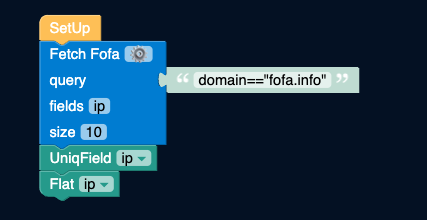
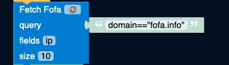

# Filter Independent IP

- Get IPs and perform deduplication, outputting one independent IP per line.

[](https://store.fofa.info/fofahub/doc/video/filter_independent_ip_20230719.mp4)

- By entering the FOFA query statement in the upper right input box, you can search for corresponding assets in FOFA. Then, perform IP deduplication on the obtained assets and output them as single-line IPs.

## Use Cases

- People who need to filter IPs and combine with other tools for asset management.

- People who need to obtain independent IPs without downloading and directly extract and copy-paste them into scanners.


## How to Use
- Modify the text box on the right side of the "Fetch Fofa" block, and enter the FOFA query syntax. In this document, we perform asset filtering with domain=="fofa.info" as the target asset.

- Modify the size in the "Fetch Fofa" block. The current setting is 10, which can be adjusted according to your needs.

## Execution Results
- Taking `domain="fofa.info"` as an example, the execution time is about 1 second when the size is set to 10.

- For fofa.info, the results of independent IP filtering are shown below:


- This result does not need to be downloaded and can be directly opened and copied and pasted to other places.


## Step Decomposition
- There are a total of 3 blocks in this workflow, in addition to the initial initialization block. Below, we will explain the purpose of each block one by one.



### Fetch Fofa
- As the name suggests, the "Fetch Fofa" block performs queries on the input content on the right using the FOFA API.

- The field is the field returned by the API interface. Here, we only need the IP field, so only the IP field is returned.

- The size is set to 10 by default for easy testing of the demo. If the quantity is set to over 100, it will use your own API token.



### Uniq Field: ip
- Here, you can specify which field to deduplicate based on. After deduplication, only the current field remains deduplicated.


- If you need to keep other fields, we will explain techniques in the future article.

### Flat ip
- `Flat` applies to lists and multi-line JSON settings, flattening the specified fields.


- Taking the current data as an example, the deduplicated IPs are as follows:
```json
{"ip":"106.xx.xx.17"}
{"ip":"118.xx.xx.182"}
{"ip":"161.xx.xx.172"}
{"ip":"172.xx.xx.15"}
{"ip":"222.xx.xx.181"}
```
- After flattening, the current data is changed to:
```
106.xx.xx.17
118.xx.xx.182
161.xx.xx.172
172.xx.xx.15
222.xx.xx.181
```