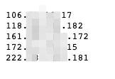
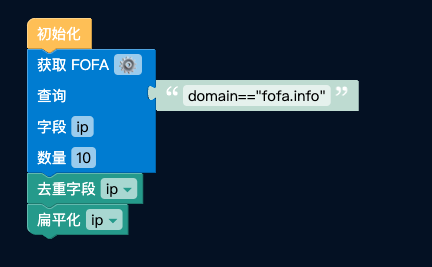
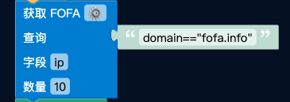

# 独立IP筛选

- 获取IP并进行去重操作，输出一行一个的独立IP

[](https://store.fofa.info/fofahub/doc/video/%E7%8B%AC%E7%AB%8BIP%E7%AD%9B%E9%80%89_20230706.mp4)

- 通过将查询的FOFA语句输入右上上侧的输入框中，即可在 FOFA 中搜索对应资产。再对于当前所获取到的所有资产进行IP去重，以单行 IP 为内容进行输出。

## 适用场景

- 需要筛选IP并联合其他工具进行资产筛查的人员

- 需要获取独立IP，不下载直接进行提取并复制粘贴进扫描器的人员

## 使用方法
- 修改 获取FOFA 积木块右侧的文本框，在其中输入 FOFA 查询语法，本文中以 domain=="fofa.info" 为目标资产进行筛查

- 修改 获取FOFA 积木块中的数量，当前设置为 10，可以根据自身需求增加或减少

## 执行结果
- 以 domain="fofa.info" 为例，当查询数量为 10 时，执行时间在 1 秒左右

- 对 fofa.info 进行独立IP筛选，执行效果如下图：



- 该结果不用下载，可直接点开对应文件并复制粘贴至其他地方


## 步骤分解
- 本次的流程中共计 3 个积木块，与最开始的初始化模块，下面我们将挨个讲解每个块的用途。



### 获取 FOFA
- 顾名思义，获取 FOFA 块通过 FOFA API 对右边的输入内容进行查询

- 字段为 API 接口返回的字段，在这里我们只需要它的 ip，所以只返回 ip 字段

- 数量默认设置为10，方便大家测试 demo 使用，数量设置在 100 条以上后会调用自身的 API



### 去重字段 ip
- 这里可以指定根据哪个字段进行去重，去重后仅保留当前字段，以当前案例为例，去重后仅剩已去重的 ip 字段


- 如果需要保留其余字段，我们可以在下个文章中展开讲解
### 扁平化 ip
- 扁平化针对于列表、多行json设置，将指定的字段进行扁平化处理。


- 以当前数据为例，去重 ip 后的数据如下：
```json
{"ip":"106.xx.xx.17"}
{"ip":"118.xx.xx.182"}
{"ip":"161.xx.xx.172"}
{"ip":"172.xx.xx.15"}
{"ip":"222.xx.xx.181"}
```
- 那么在扁平化之后，当前数据被改为：
```
106.xx.xx.17
118.xx.xx.182
161.xx.xx.172
172.xx.xx.15
222.xx.xx.181
```