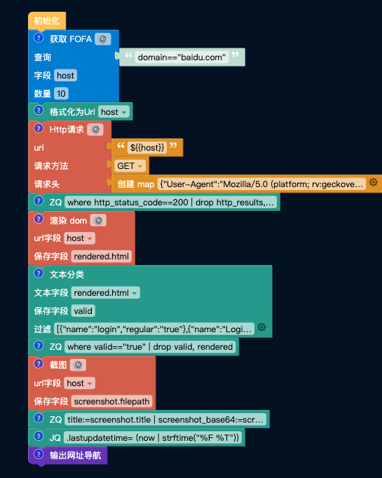
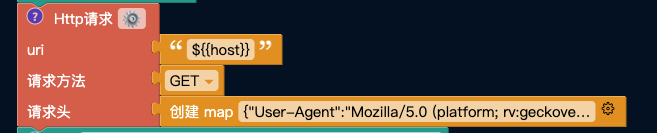
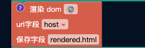
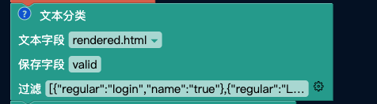
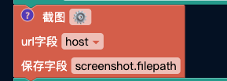

## 登陆页面查找
- 查找目标资产中的登陆页面，并输出为网址导航。

```HTML
<video width="320" height="240" controls>
    <source src="https://store.fofa.info/fofahub/doc/video/%E7%8B%AC%E7%AB%8BIP%E7%AD%9B%E9%80%89_20230706.mp4)](https://store.fofa.info/fofahub/doc/video/%E7%8B%AC%E7%AB%8BIP%E7%AD%9B%E9%80%89_20230706.mp4" type="video/mp4">
</video>
```


通过将查询的FOFA语句输入右上上侧的输入框中，即可在 FOFA 中搜索对应资产。再对于当前所获取到的所有资产进行自动筛选，获取页面中存在 “登陆”、“Login” 等字眼的资产，最后将筛选出的资产通过网址导航块进行输出。


## 使用场景
- 本流程适用于在资产梳理时需要快速识别登陆页面的人员


## 使用方法
- 修改 获取FOFA 积木块右侧的文本框，在其中输入 FOFA 查询语法，本文中以 domain="fedex.com" 为目标资产进行筛查
- 修改 获取FOFA 积木块中的数量，当前设置为 10，可以根据自身需求增加或减少


## 执行结果
- 以 domain="fedex.com" 为例，当查询数量为 10 时，执行时间在 1 分 05 秒左右；当查询数量为 50 时，执行时间在 3 分钟左右
- 对 fedex.com 进行批量筛查，执行效果如下图：


- 点击网址导航栏中的任意框，即可跳转到对应页面


## 步骤分解
- 本次的流程中共计 11 个积木块，与最开始的初始化模块，下面我们将挨个讲解每个块的用途。



### 获取 FOFA

顾名思义，获取 FOFA 块通过 FOFA API 对右边的输入内容进行查询

字段为 API 接口返回的字段，在这里我们只需要它的 host，所以只返回 host 字段

数量默认设置为10，方便大家测试 demo 使用，数量设置在 100 条以上后会调用自身的 API。


### 格式化为 Url
由于 API 接口中的 host 值在 http 协议下不带 Schema 前缀，而在 https 协议下携带 Schema 前缀，使用该积木块就是为了将 host 统一为带有 Schema 的链接


### Http请求

当完成对于链接的格式化，我们就可以通过 Http请求 模块对目标进行请求

该步骤是为了初步测试每个网站是否可以连通，也为我们后续的 渲染dom/截图 等模块筛选掉多数无效数据，提升后续执行效率。



### ZQ
本ZQ语句为 
```
where http_status_code==200 | drop http_results, http_result, http_status_code
```

该ZQ语句的意思为：保留返回值为200的数据，并清除 Http请求 块中生成的多余数据


### 渲染 dom
当进行到这一步，我们获得的就是全部存活（返回值为200）的链接了

通过对 host 对应的链接进行请求，并进行 dom 渲染，获取网页的具体内容

Dom 渲染需要一定时间，所以在这一步会等待两到三秒，才会出现进度。



### 文本分类

网页的具体内容中可能包含 “登陆”、“Login”、“Password” 等字眼，通过将这些关键字添加到文本分类中，进行匹配

成功匹配的网页则被我们认为存在登陆接口，那么对于该类型的网站可以用一个 valid 字段进行标识 



### ZQ

本ZQ语句为 
```
where valid=="true" | drop valid, rendered
```

该ZQ语句的意思为：筛选出标记为 valid 的网站，并且丢弃掉多余的字段

筛选结束后保留的结果就是我们想要寻找的，带有登陆接口的页面了


### 截图

拿到结果后，我们通过截图块对目标进行截图，方便后续查看结果

截图同时会输出截图时获取到的 网站标题，记住这里，在下一步会需要到它。



### ZQ

本ZQ语句为 
```
title:=screenshot.title | screenshot_base64:=screenshot.base64 | drop screenshot | url:=host | drop host
```

该ZQ语句的意思为：获取截图时输出的网站标题（title），截图的 Base64值（screenshot_base64），访问地址（url），然后删除（drop）掉多余的字段


### JQ

本JQ语句为 
```
.lastupdatetime= (now | strftime("%F %T"))
```

该JQ语句的意思为：获取当前时间并将其赋值在 lastupdatetime 字段中，该字段为 `输出网址导航` 块需要的字段


### 输出网址导航

通过指定 `title`、`screenshot_base64`、`url`、`lastupdatetime` 四个字段生成网址导航信息

其中 `title` 对应网站标题，`screenshot_base64` 对应网站截图的base64格式，`url` 对应网站的访问地址，`lastupdatetime` 对应生成的时间。


一个输入到网址导航且能成功出现结果的样例参考:
```json
{

"lastupdatetime": "2023-07-04 10:08:38",

"screenshot_base64": "data:image/png;base64,iVBORw0KGgoAAA...",

"title": "Purxxx- Sign In",

"url": "https://xxx.fedex.com"

}
```
