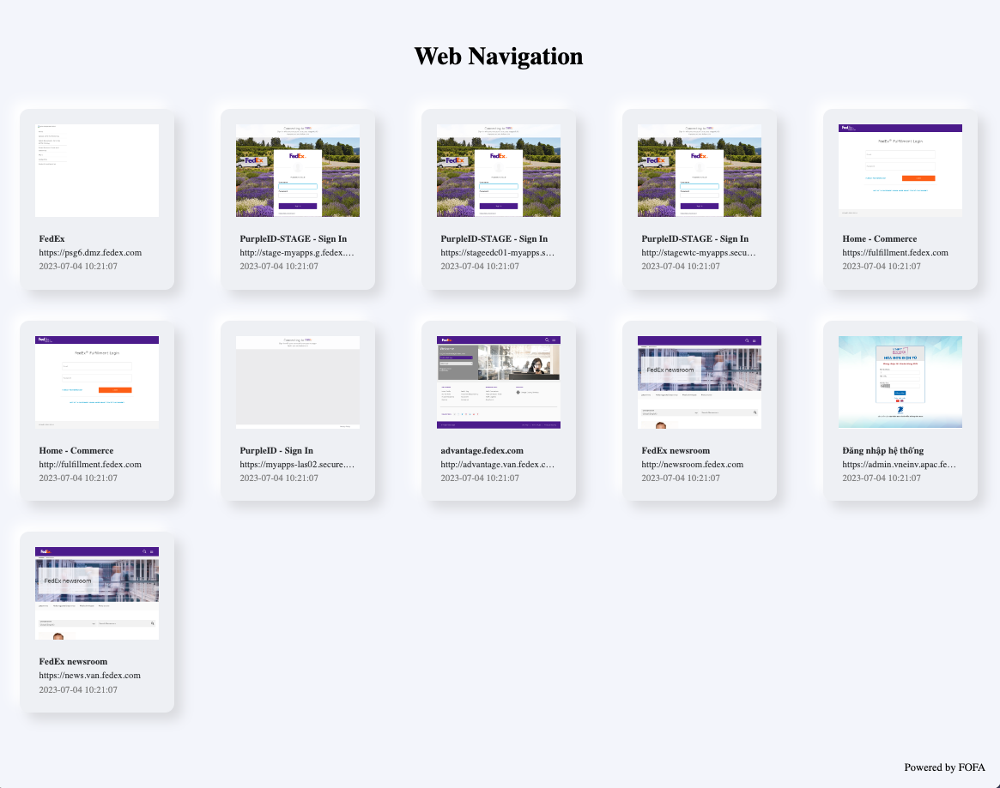
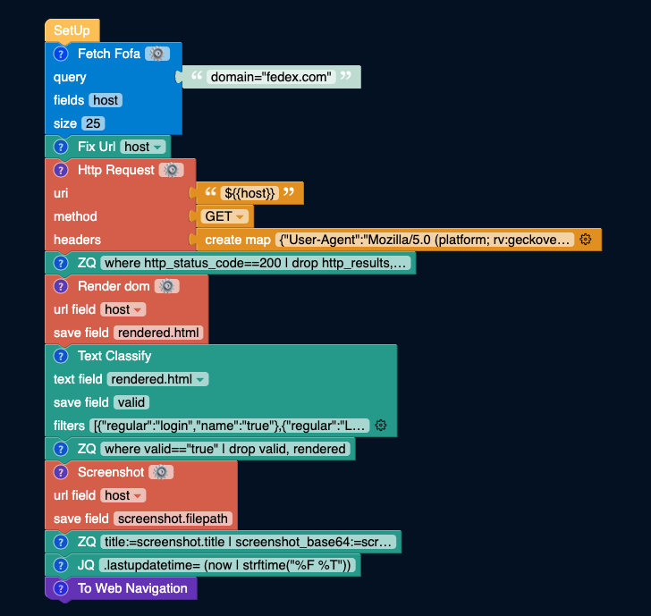
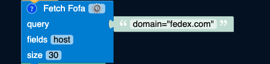
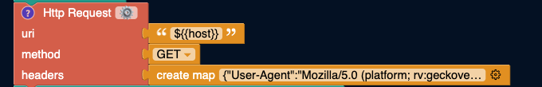
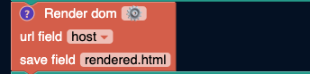
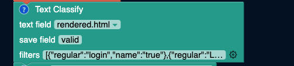
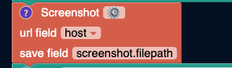

## Login Discovery
- Find login pages in target assets and output them as a web navigation page.


[](https://store.fofa.info/fofahub/doc/video/login_discovery_20230719.mp4)


By entering the FOFA query statement in the input box on the upper right side, you can search for corresponding assets in FOFA. Then, automatically filter all the obtained assets and retrieve the assets that have words such as "login" or "Login" on the web page. Finally, output the filtered assets as a web navigation.


## Use Cases
- This workflow is suitable for individuals who need to quickly identify login pages during asset organization.


## Usage
- Modify the text box on the right side of the "Fetch FOFA" block and enter the FOFA query syntax. In this article, we use `domain="fedex.com"` as the target asset for asset discoverying.
- Modify the "Fetch FOFA" block to adjust the size. The current size is set to 10, but you can adjust it according to your needs.


## Execution Results
- Taking `domain="fedex.com"` as an example, the execution time is around 1 minute and 5 seconds when the query size is 10. When the query size is 50, the execution time is around 3 minutes.
- Asset discovering of domain `fedex.com` produces the following results:


- Click on any box in the web navigation page to jump to the corresponding page.

## Step Breakdown
- This workflow consists of a total of 11 blocks, including the `Setup` block at the beginning. Let's explain the purpose of each block one by one.



### Fetch FOFA

As the name suggests, the "Fetch FOFA" block queries the content on the right side using the FOFA API.

The fields correspond to the fields returned by the API interface. In this case, we only need the "host" field.

The size is set to 10 by default for easy testing of the demo. If the size is set to over 100, it will use your own API token.




### Fix URL
Since the "host" value in the API interface does not include the schema prefix under the HTTP protocol but includes it under the HTTPS protocol, this block is used to unify the host as a URL with the schema prefix.


### HTTP Request

Once the links are formatted, we can use the "HTTP Request" block to send requests to the targets.

This step is to test whether each website is alive or not, and to filter out most of the invalid data in subsequent blocks such as "Render DOM" or "Screenshot" to improve the execution efficiency.



### ZQ
The ZQ statement is as follows:
```
where http_status_code==200 | drop http_results, http_result, http_status_code
```

This ZQ statement means: keep the data with a response value of 200 and drop the redundant data generated in the "HTTP Request" block.


### Render DOM
At this point, we have obtained all the live links (response value is 200).

By sending requests to the corresponding host links and rendering the DOM, we can retrieve the specific content of the web pages.

DOM rendering takes some time, so the progress will appear after waiting for 2~3 seconds.



### Text Classification

The specific content of web pages may contain words such as "login," "Login," or "Password." By adding these keywords to the "Text Classification" block, we can match them.

If a web page is successfully matched, we consider it to have a login interface. We can use a "valid" field to identify websites of this type.



### ZQ
The ZQ statement is as follows:
```
where valid=="true" | drop valid, rendered
```

This ZQ statement means: filter out websites marked as "valid" and drop the redundant fields.

After the filtering, we are left with the web pages we want to find, which have login interfaces.


### Screenshot

After obtaining the results, we use the "Screenshot" block to capture screenshots of the targets for easier viewing of the results.

The screenshot block also outputs the website title captured during the screenshot. Remember this because we will need it in the futher step.



### ZQ

The ZQ statement is as follows:
```
title:=screenshot.title | screenshot_base64:=screenshot.base64 | drop screenshot | url:=host | drop host
```

This ZQ statement means: get the website title (`title`) and the screenshot in Base64 format (`screenshot_base64`) captured during the screenshot, as well as the URL (`url`). Then, drop the unnecessary fields (`screenshot` and `host`).


### JQ

The JQ statement is as follows:
```
.lastupdatetime= (now | strftime("%F %T"))
```

This JQ statement means: get the current time and assign it to the `lastupdatetime` field, which is required for the "To Web Navigation" block.


### To Web Navigation

Generate web navigation information by specifying four fields: `title`, `screenshot_base64`, `url`, and `lastupdatetime`.

Among them, `title` corresponds to the website title, `screenshot_base64` corresponds to the Base64 format of the website screenshot, `url` corresponds to the website URL, and `lastupdatetime` corresponds to the generated time.


Here's an example of the input for the web navigation that produces a successful result:
```json
{
  "lastupdatetime": "2023-07-04 10:08:38",
  "screenshot_base64": "data:image/png;base64,iVBORw0KGgoAAA...",
  "title": "Purxxx- Sign In",
  "url": "https://xxx.fedex.com"
}
```
